# Structured Chain-of-Thought Prompting

This document presents a series of iteratively refined prompts (13 iterations) that progressively generate a Late Victorian and Edwardian UK school building, with the final iteration producing a ground floor plan corresponding to the exterior from Iteration 12.
For each iteration, the prompt is shown first, followed by the generated image.

---

## Iteration 1

Prompt:  
Generate an image of a building.

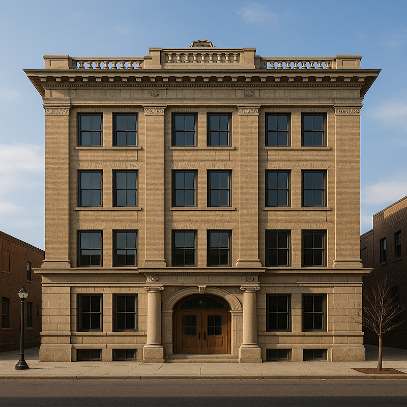

## Iteration 2

Prompt:  
Generate an image of a school building.

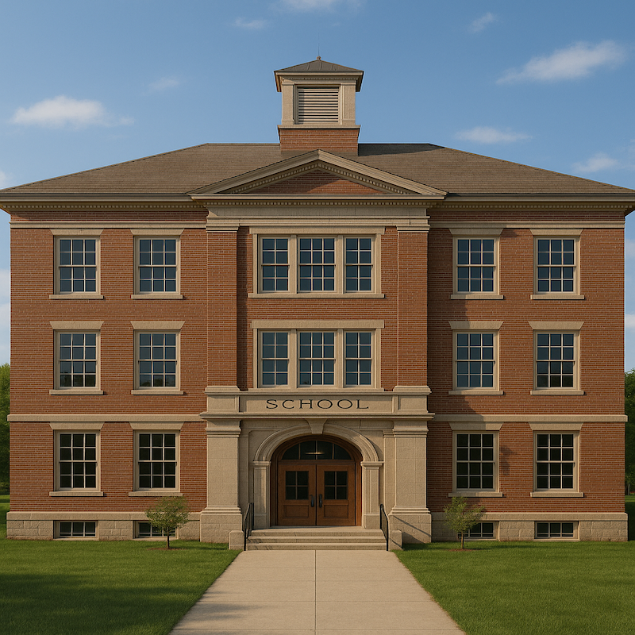

---

## Iteration 3

Prompt:  
Generate an image of a Victorian school building.

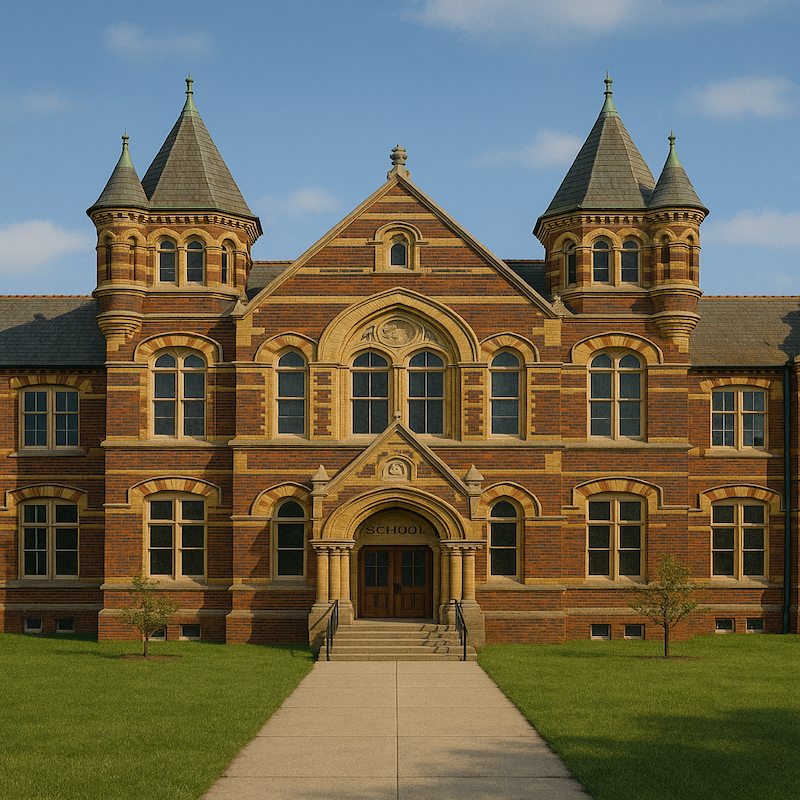
  

---

## Iteration 4

Prompt:  
Generate an image of a Late Victorian and Edwardian (1870–1914) school building in the UK.

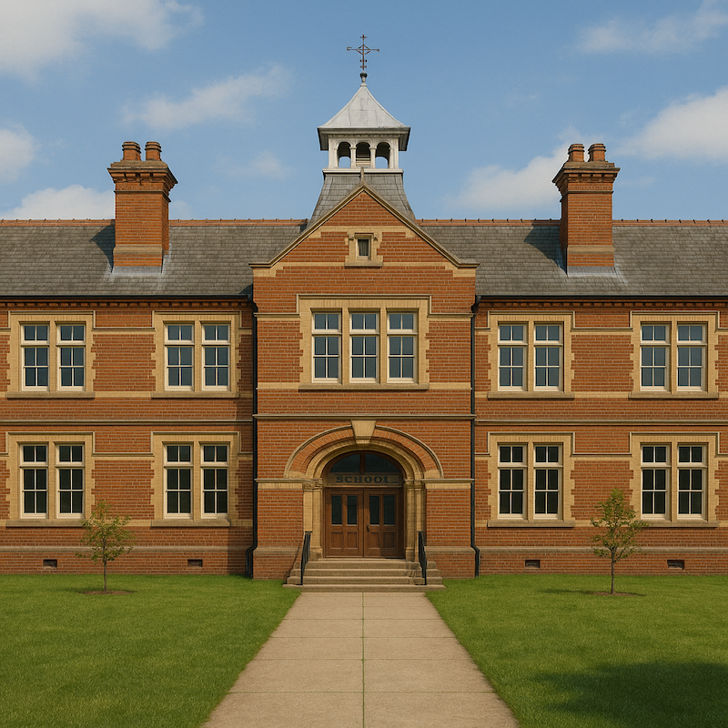

---

## Iteration 5

Prompt:  
Generate an image of a Late Victorian and Edwardian (1870–1914) school building in the UK with a pavilion or hall-classroom layout.

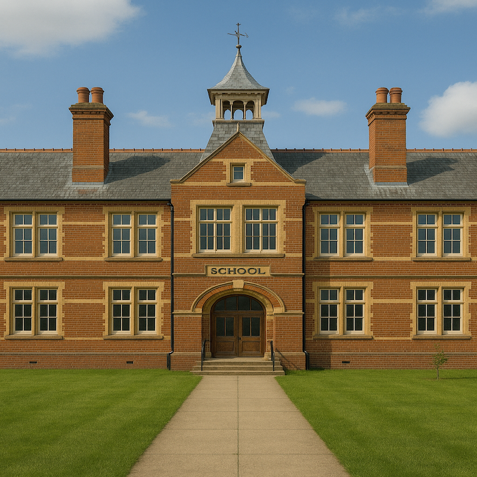

---

## Iteration 6

Prompt:  
Generate an image of a Late Victorian and Edwardian (1870–1914) school building in the UK with a pavilion or hall-classroom layout and stair towers.

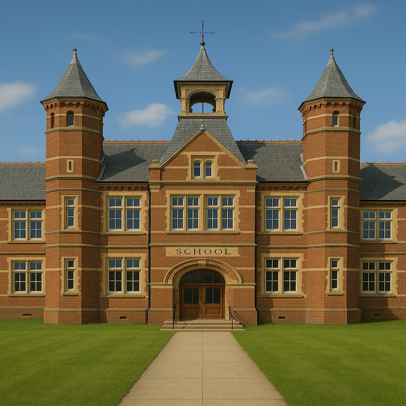

---

## Iteration 7

Prompt:  
Generate an image of a Late Victorian and Edwardian (1870–1914) school building in the UK with a pavilion or hall-classroom layout and stair towers, constructed with brick load-bearing walls, iron beams, and timber floors.

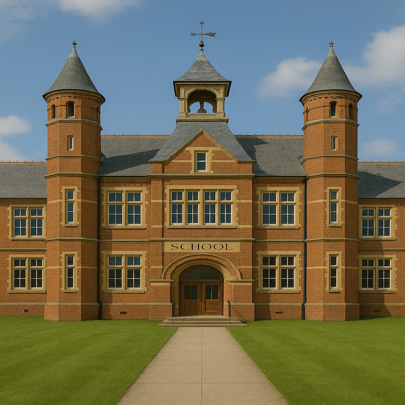

---

## Iteration 8

Prompt:  
Generate an image of a Late Victorian and Edwardian (1870–1914) school building in the UK with a pavilion or hall-classroom layout and stair towers, constructed with brick load-bearing walls, iron beams, and timber floors, featuring ornamental brick and terracotta detailing.

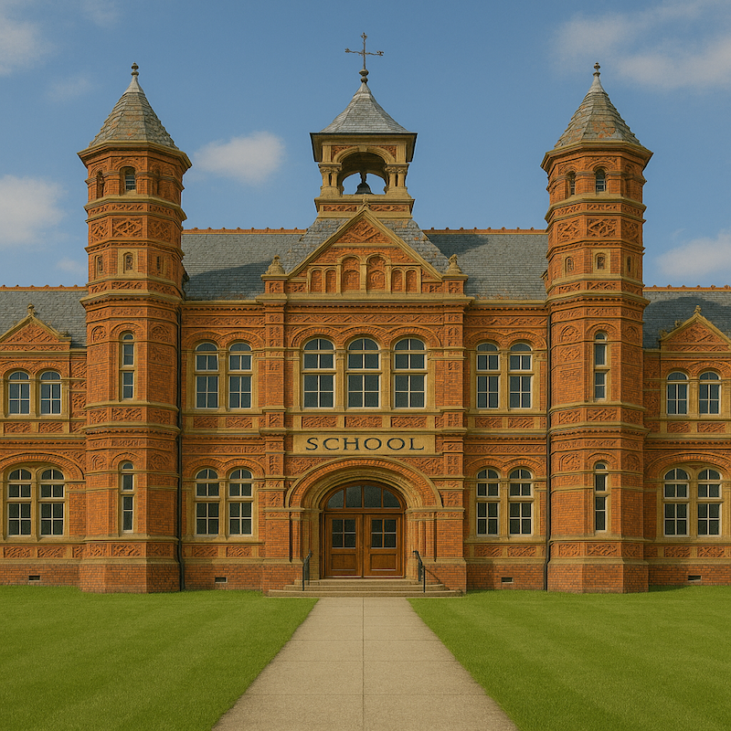

---

## Iteration 9

Prompt:  
Generate an image of a Late Victorian and Edwardian (1870–1914) school building in the UK with a pavilion or hall-classroom layout and stair towers, constructed with brick load-bearing walls, iron beams, and timber floors, featuring ornamental brick and terracotta detailing and sash windows.

---

## Iteration 10

Prompt:  
Generate an image of a Late Victorian and Edwardian (1870–1914) school building in the UK with a pavilion or hall-classroom layout and stair towers, constructed with brick load-bearing walls, iron beams, and timber floors, featuring ornamental brick and terracotta detailing and sash windows, with high ceilings and ridge ventilators.

---

## Iteration 11

Prompt:  
Generate an image of a Late Victorian and Edwardian (1870–1914) school building in the UK with a pavilion or hall-classroom layout and stair towers, constructed with brick load-bearing walls, iron beams, and timber floors, featuring ornamental brick and terracotta detailing and sash windows, with high ceilings and ridge ventilators, reflecting the educational reforms of the 1870 Elementary Education Act and the establishment of local school boards.

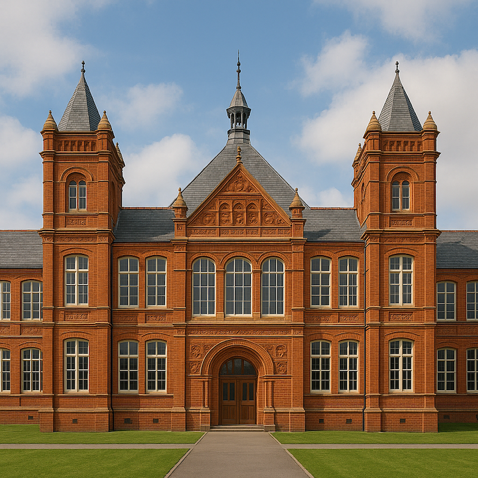

---

## Iteration 12

Prompt:  
Generate an image of a Late Victorian and Edwardian (1870–1914) school building in the UK with a pavilion or hall-classroom layout and stair towers, constructed with brick load-bearing walls, iron beams, and timber floors, featuring ornamental brick and terracotta detailing and sash windows, with high ceilings and ridge ventilators, reflecting the educational reforms of the 1870 Elementary Education Act and the establishment of local school boards, exemplified by the Board Schools of London and Birmingham.

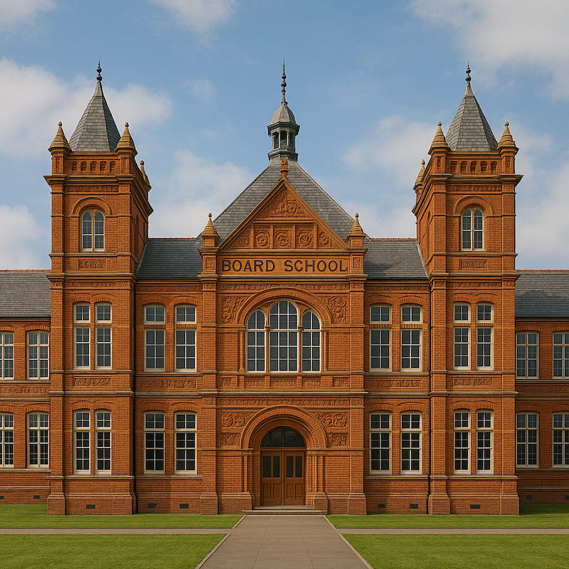

---

## Iteration 13 — Corresponding Interior Generation

Prompt:  
Generate the corresponding interior floorplan for this façade.

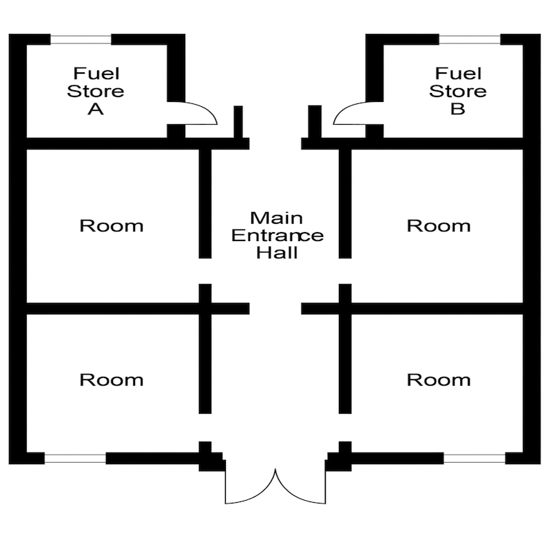
