# Direct Prompting — Historical School Typologies

This document records the direct prompt catalogue used to generate façade and floorplan images across historical school typologies.
For each typology, the floorplan and façade prompts are shown first, followed by their corresponding generated images.

---

## Medieval–Georgian (Pre-1830s)

### Floorplan Prompt

An orthographic architectural floor plan drawn at 1:100 scale of a Medieval–Georgian (pre-1830s) school building with monastic origins, representing a reused great hall with cellular classrooms.  
The structure is stone/brick load-bearing with loadbearing external walls (450 mm) and thin internal partitions (150 mm).  
The plan shows a large great hall flanked by smaller cellular classrooms off corridors with classical ordering.  
Doors and windows are shown accurately, symmetrically aligned, and evenly spaced.  
Black linework on light parchment background, true 1:100 scale, no text or labels.  
--no text, annotations, people, furniture, shadows, 2D perspective

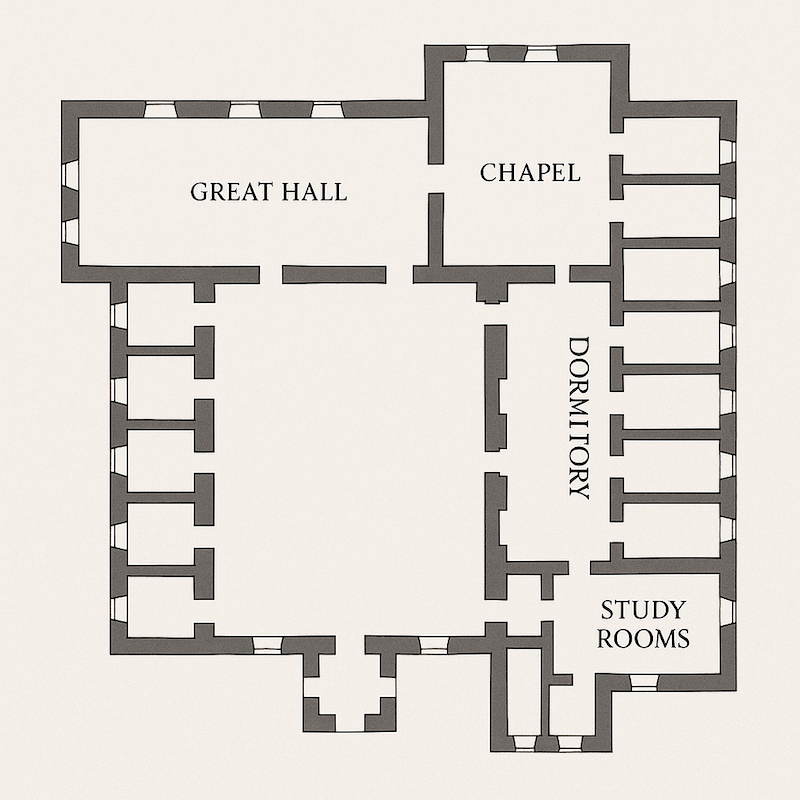

---

### Façade Prompt

A realistic orthographic front elevation corresponding to the Medieval–Georgian (pre-1830s) floor plan of a school building with monastic origins, representing a reused great hall with cellular classrooms.  
The structure uses thick masonry with mullioned windows.  
The central façade features a tall gable with arched windows, flanked by square stair towers with pyramidal roofs.  
Composition is symmetrical, window rhythm matches the plan, and materials include slate roofing and stone trim.  
Rendered in limited daylight, orthographic projection, realistic materials, no people or text.

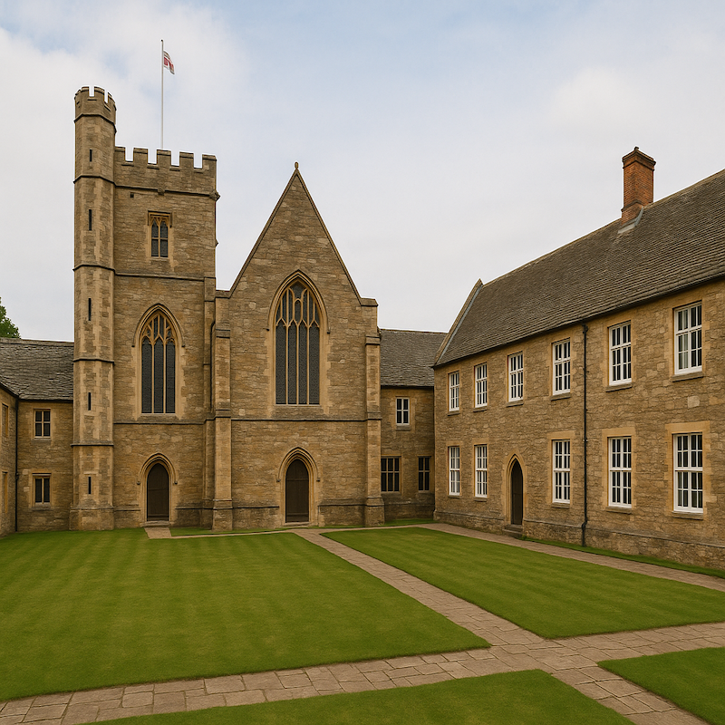

---

## Early–Mid Victorian (1830s–1870s)

### Floorplan Prompt

An orthographic architectural floor plan drawn at 1:100 scale of an Early–Mid Victorian (1830s–1870) school building, representing the hall-and-classroom basilican layout.  
The structure is brick with timber roofs, loadbearing external walls (450 mm) and thin internal partitions (150 mm).  
The plan shows a large central hall flanked by smaller side classrooms on both sides.  
Doors and windows are shown accurately, symmetrically aligned, and evenly spaced.  
Black linework on light parchment background, true 1:100 scale, no text or labels.  
--no text, annotations, people, furniture, shadows, 2D perspective

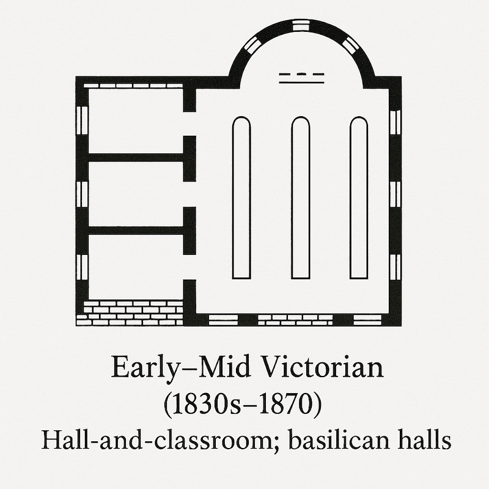

---

### Façade Prompt

A realistic orthographic front elevation corresponding to the Early–Mid Victorian (1830s–1870) floor plan of a hall-and-classroom basilican school with side classrooms.  
The structure uses polychrome brick with tall arched windows.  
The central façade features a tall gable with arched windows, flanked by square stair towers with pyramidal roofs.  
Composition is symmetrical, window rhythm matches the plan, and materials include slate roofing and stone trim.  
Rendered in maximised daylight, orthographic projection, realistic materials, no people or text.

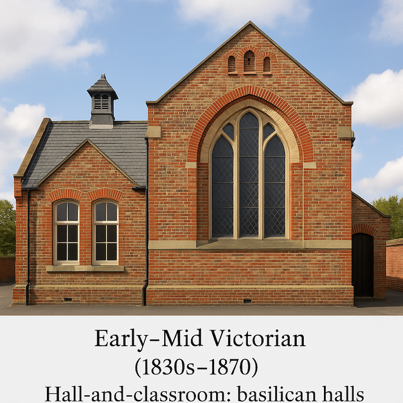

---

## Late Victorian & Edwardian (1870–1914)

### Floorplan Prompt

An orthographic architectural floor plan drawn at 1:100 scale of a Late Victorian & Edwardian (1870–1914) school building, representing a pavilion or hall-classroom layout with stair towers.  
The structure is brick with iron beams and timber floors, with loadbearing external walls (450 mm) and thin internal partitions (150 mm).  
The plan shows a large central hall flanked by smaller stair tower pavilions on both sides.  
Doors and windows are shown accurately, symmetrically aligned, and evenly spaced.  
Black linework on light parchment background, true 1:100 scale, no text or labels.  
--no text, annotations, people, furniture, shadows, 2D perspective

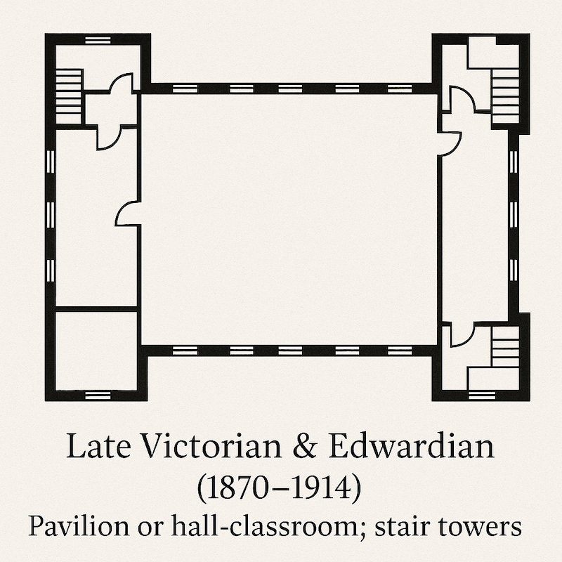

---

### Façade Prompt

A realistic orthographic front elevation corresponding to the Late Victorian & Edwardian (1870–1914) floor plan of a pavilion or hall-classroom school with stair towers.  
The structure uses ornamental red brick and terracotta with sash windows.  
The central façade features a tall gable with arched windows, flanked by square stair towers with pyramidal roofs.  
Composition is symmetrical, window rhythm matches the plan, and materials include slate roofing and stone trim.  
Rendered in soft daylight, orthographic projection, realistic materials, no people or text.

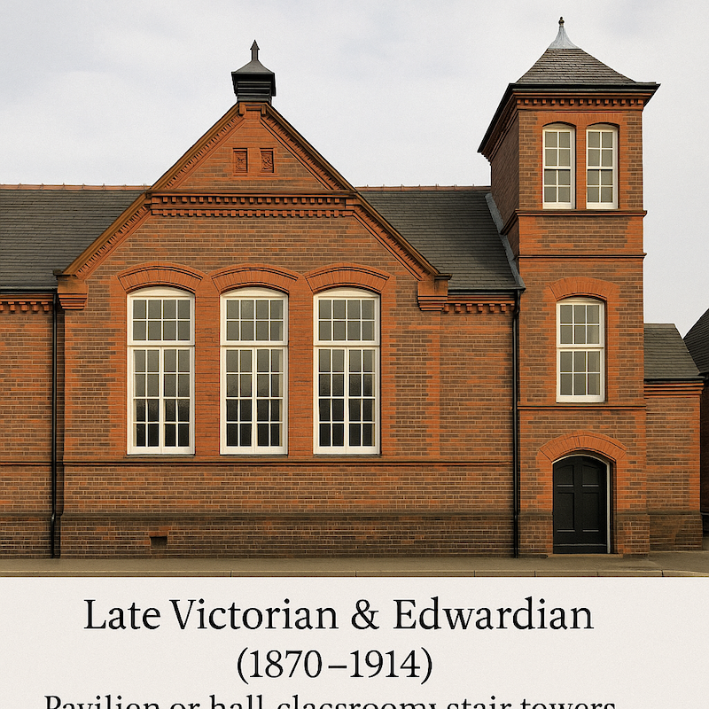

---

## Interwar & Open-Air (1918–1939)

### Floorplan Prompt

An orthographic architectural floor plan drawn at 1:100 scale of an Interwar & Open-Air (1918–1939) school building, representing single-storey pavilions with verandas.  
The structure is brick with steel windows, loadbearing external walls (450 mm) and thin internal partitions (150 mm).  
The plan shows south-facing classrooms with a single-storey pavilion layout and outdoor teaching courts.  
Doors and windows are shown accurately, symmetrically aligned, and evenly spaced.  
Black linework on light parchment background, true 1:100 scale, no text or labels.  
--no text, annotations, people, furniture, shadows, 2D perspective

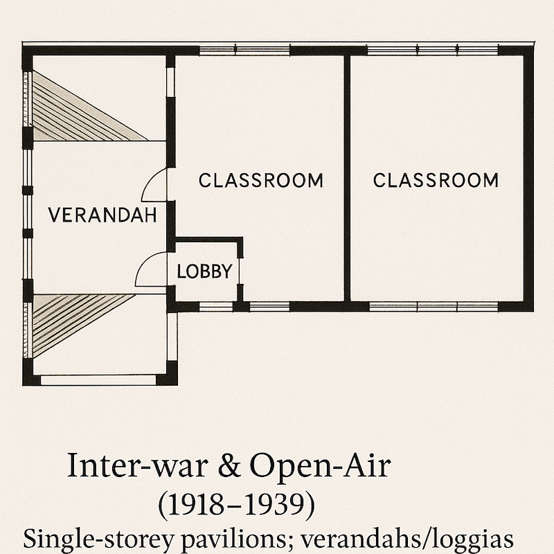

---

### Façade Prompt

A realistic orthographic south-facing elevation corresponding to the Interwar & Open-Air (1918–1939) floor plan of a school building with single-storey pavilions and verandas.  
The structure uses facing brick strips with opening lights, flat roofs, explicit cross-ventilation and outdoor teaching courts.  
The central façade features a single-storey pavilion layout with south-facing classrooms, steel windows and flat roofs.  
Composition is symmetrical, window rhythm matches the plan, and materials include brick and steel windows.  
Rendered in soft daylight, orthographic projection, realistic materials, no people or text.

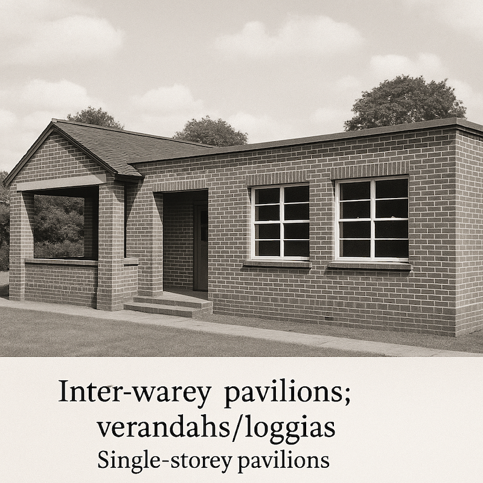

---

## Immediate Postwar (1944–1950s)

### Floorplan Prompt

An orthographic architectural floor plan drawn at 1:100 scale of an Immediate Postwar (1944–1950s) school building, representing cellular classrooms with covered ways.  
The structure is steel lightweight frame construction, with loadbearing external walls (450 mm) and thin internal partitions (150 mm).  
The plan shows cellular classrooms with specialist rooms such as assembly and dining halls as central “hearts”.  
Doors and windows are shown accurately, symmetrically aligned, and evenly spaced.  
Black linework on light parchment background, true 1:100 scale, no text or labels.  
--no text, annotations, people, furniture, shadows, 2D perspective

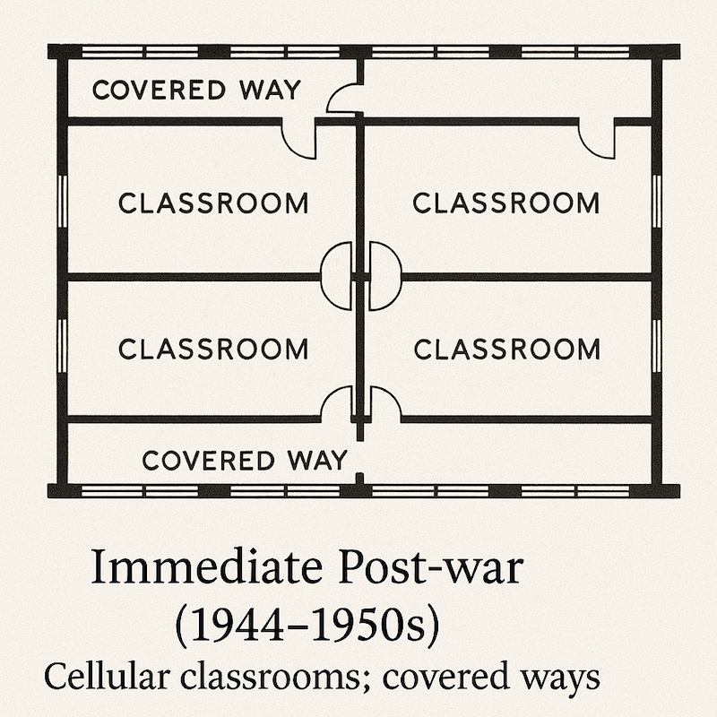

---

### Façade Prompt

A realistic orthographic front elevation corresponding to the Immediate Postwar (1944–1950s) floor plan of cellular classrooms with covered ways.  
The structure uses high glazing, panel infill and flat roofs.  
The central façade features cellular classrooms with specialist rooms, assembly/dining halls as central “hearts”, and external covered ways.  
Composition is symmetrical, window rhythm matches the plan, and materials include flat roofs, panel infill and high glazing.

---

## System-Building & Open-Plan (1950s–1970s)

### Floorplan Prompt

An orthographic architectural floor plan drawn at 1:100 scale of a System-Building & Open-Plan (1950s–1970s) school building, representing open-plan primary schools and deep-plan courts.  
The structure is prefabricated modular (CLASP, SCOLA), with non-loadbearing external walls (450 mm) and thin internal partitions (150 mm).  
The plan shows an open-plan primary adapted as a “home-base” with moveable screens and shared resource areas.  
Doors and windows are shown accurately, symmetrically aligned, and evenly spaced.  
Black linework on light parchment background, true 1:100 scale, no text or labels.  
--no text, annotations, people, furniture, shadows, 2D perspective

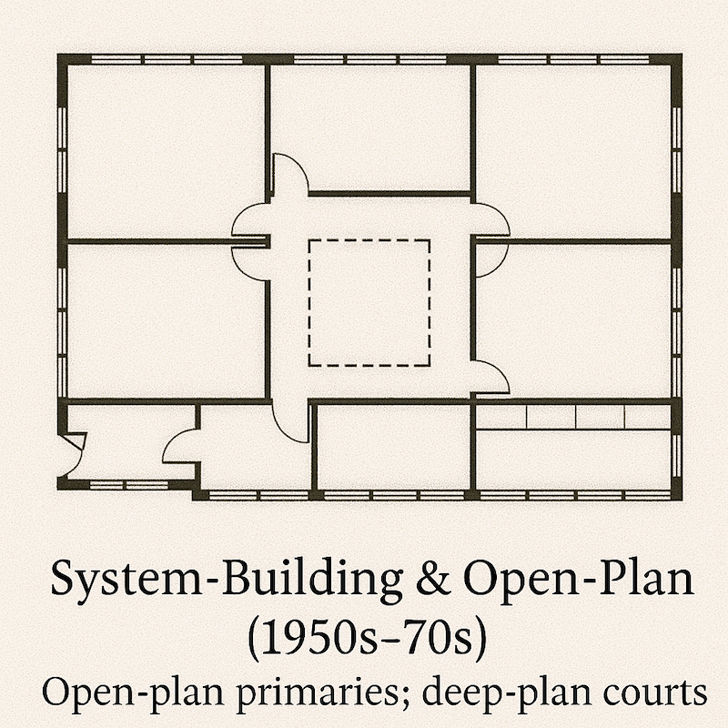

---

### Façade Prompt

A realistic orthographic front elevation corresponding to the System-Building & Open-Plan (1950s–1970s) floor plan of an open-plan primary school with a deep-plan court.  
The structure uses curtain walls and cladding panels.  
The central façade consists of open-plan “home-bases” with moveable screens and shared resource areas, curtain-wall glazing, flat roofs and deep-plan blocks around courtyards.  
Composition is based on prefabricated modular systems (CLASP, SCOLA), using light-gauge steel or timber frames, standard bays, dry cladding panels and non-loadbearing partitions.  
Rendered in soft daylight, orthographic projection, realistic materials, no people or text.

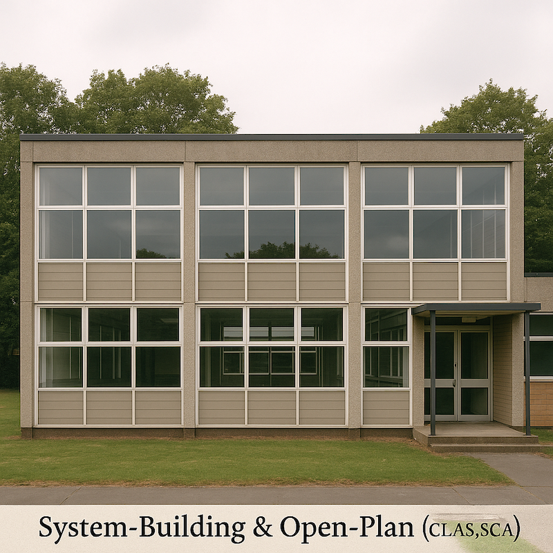

---

## Post-oil-crisis Rationalisation (1970s–1990s)

### Floorplan Prompt

An orthographic architectural floor plan drawn at 1:100 scale of a Post-oil-crisis (1970s–1990s) school building, representing a repartitioned open-plan with deep atria (secondary).  
The structure is composite concrete, with loadbearing external walls (450 mm) and thin internal partitions (150 mm).  
The plan shows the repartitioning of an open-plan into cellular rooms around a deep atrium.  
Doors and windows are shown accurately, symmetrically aligned, and evenly spaced.  
Black linework on light parchment background, true 1:100 scale, no text or labels.  
--no text, annotations, people, furniture, shadows, 2D perspective

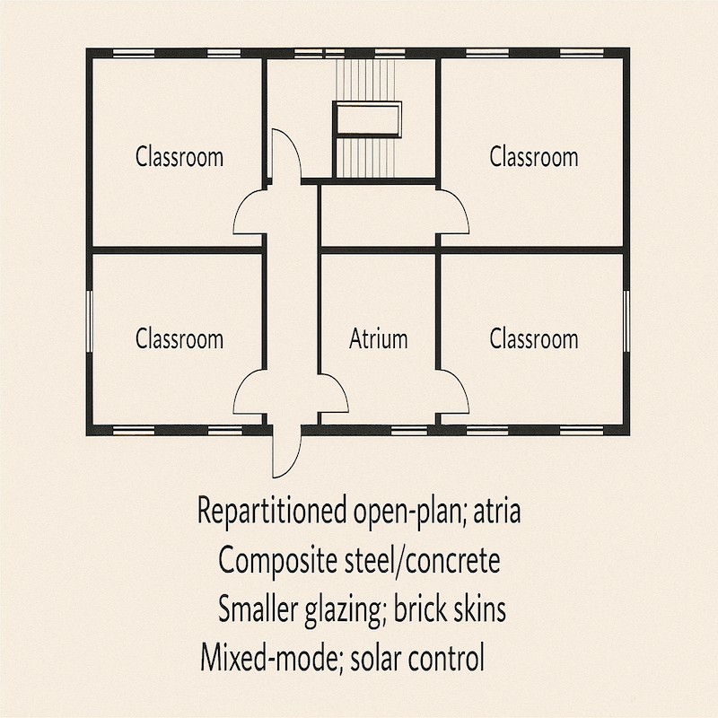

---

### Façade Prompt

A realistic orthographic front elevation corresponding to the Post-oil-crisis (1970s–1990s) floor plan of a repartitioned open-plan with a deep atrium (secondary).  
The structure uses reduced glazing and brick skins.  
The central façade features a repartitioned open-plan with a deep atrium.  
Composition includes value-engineered claddings and brick skins over frames for robustness.  
Rendered in mixed-mode solar-controlled daylight, orthographic projection, realistic materials, no people or text.

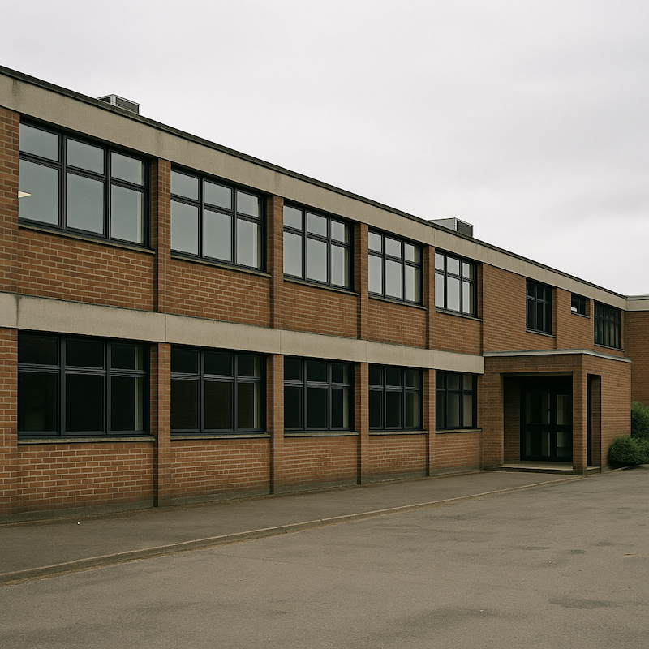

---

## PFI / BSF (2004–2010)

### Floorplan Prompt

An orthographic architectural floor plan drawn at 1:100 scale of a PFI / BSF (2004–2010) school building, representing large comprehensive campuses with learning streets, atria and breakout spaces.  
The structure is steel/composite frame, with loadbearing external walls (450 mm) and thin internal partitions (150 mm).  
The plan shows large comprehensive campuses organised around learning streets, atria and breakout spaces.  
Doors and windows are shown accurately, symmetrically aligned, and evenly spaced.  
Black linework on light parchment background, true 1:100 scale, no text or labels.  
--no text, annotations, people, furniture, shadows, 2D perspective

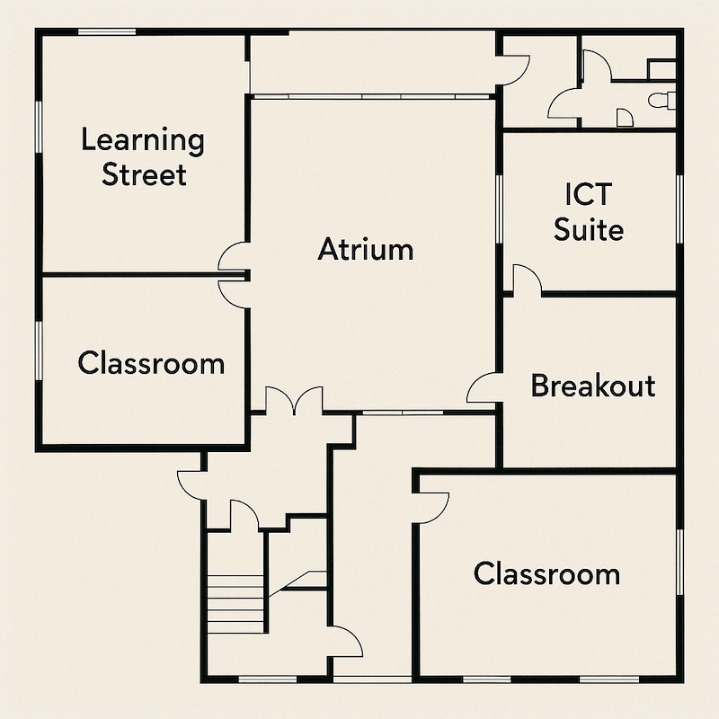

---

### Façade Prompt

A realistic orthographic front elevation corresponding to the PFI / BSF (2004–2010) school building, representing large comprehensive campuses with learning streets, atria and breakout spaces.  
The structure uses mixed façades guided by BREEAM principles.  
The central façade features a large comprehensive campus with learning streets, atria and breakout spaces, tuned for daylighting with solar control.  
Composition is symmetrical, window rhythm matches the plan, and materials include brick, rainscreen cladding and ETFE/atrium glazing.  
Rendered in daylight with solar control, orthographic projection, realistic materials, no people or text.

---

## PSBP & Standardisation (2011–2010s)

### Floorplan Prompt

An orthographic architectural floor plan drawn at 1:100 scale of a PSBP & Standardisation (2011–2010s) school building with standardised classroom bars.  
The structure consists of steel/hybrid frames (MMC), with loadbearing external walls (450 mm) and thin internal partitions (150 mm).  
The plan shows a standardised block with repeatable classroom modules.  
Doors and windows are shown accurately, symmetrically aligned, and evenly spaced.  
Black linework on light parchment background, true 1:100 scale, no text or labels.  
--no text, annotations, people, furniture, shadows, 2D perspective

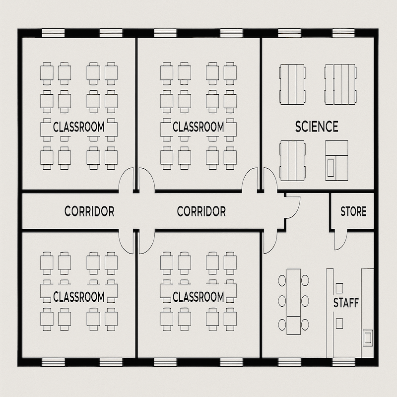

---

### Façade Prompt

A realistic orthographic front elevation corresponding to the PSBP & Standardisation (2011–2010s) floor plan of a school building with standardised classroom bars.  
The structure uses controlled glazing ratios, robust cladding and steel/hybrid frames.  
The central façade features a standardised block with repeatable classroom bars.  
Composition is symmetrical, window rhythm matches the plan.  
Rendered in soft daylight, orthographic projection, realistic materials, no people or text.

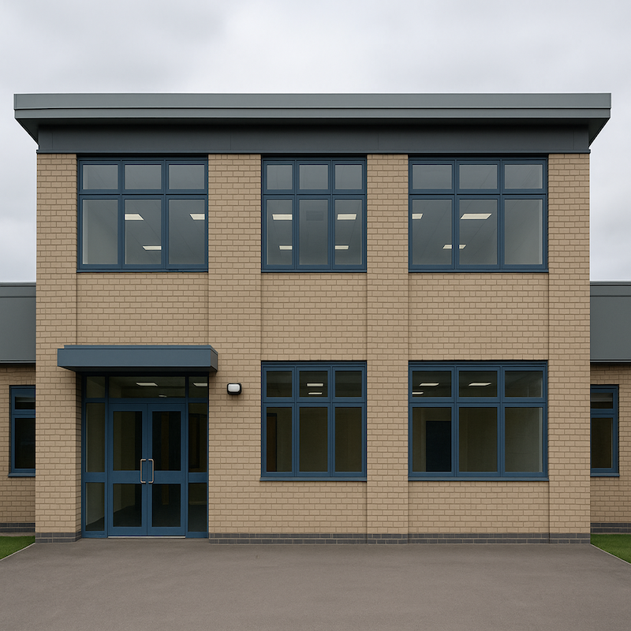
