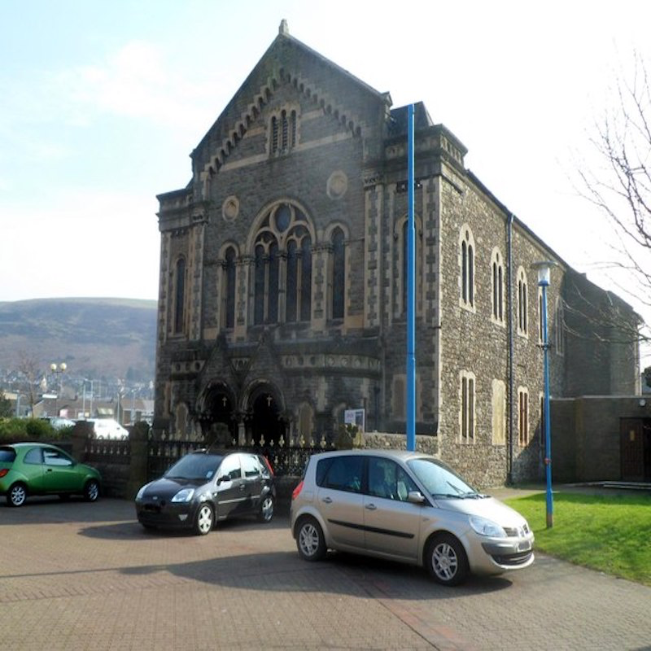

# Historical Reference Images — Sunday School Architecture

This document records the historical architectural reference images used for prompt template refinement.  
Each entry presents a reference image first, followed by the original source URL. These are not AI-generated.

---

## SS-01 — 1780s Long Millgate Sunday School

Reference URL:  
[Long Millgate Sunday School](https://www.mgs-life.co.uk/article/the-history-of-mgs-in-50-objects-23-long-millgate?ref=48 )

---

## SS-02 — 1784-1805 Stockport Sunday School

Reference URL:  
[Stockport Sunday School](https://diggreatermanchester.wordpress.com/wp-content/uploads/2020/12/covent-garden-sunday-school-panel-23.09.2019.pdf)

---

## SS-03 — 1809 Ashton-under-Lyne Sunday School

Reference URL:  
[Ashton-under-Lyne Sunday School](https://www.flickr.com/photos/snapshistory/albums/72157706239826974/ )

---

## SS-04 — 1820s Blytheswood Sunday School

Reference URL:  
[Blytheswood Sunday School](https://www.pastglasgow.co.uk/1-7-blythswood-square-c1860s/)

---

## SS-05 — 1825 Brunswick Methodist Sunday School

Reference URL:  
[Brunswick Sunday School](https://thestoryofgarforth.org.uk/?page_id=65 )

---

## SS-06 — 1830s-1840s Hope Chapel Sunday School

Reference URL:  
[Hope Chapel Sunday School](https://bristolfamilyhistoryblog.wordpress.com/2011/11/12/hope-chapel-hotwells-monumental-inscriptions/)

---

## SS-07 — 1850s Mill Hill Chapel Sunday School

Reference URL:  
[Mill Hill Chapel Sunday School](https://www.leedsbeckett.ac.uk/school-of-humanities-and-social-sciences/mill-hill/origins/ )

---

## SS-08 — 1860s Ebenezer Congregational Sunday School

Reference URL:  
[Ebenezer Sunday School](https://commons.wikimedia.org/wiki/Category:Ebenezer_Chapel,_Aberavon)

---

## SS-09 — 1868 Saltaire Sunday School

Reference URL:  
[Saltaire Sunday School](https://www.saltairecollection.org/story-of-saltaire/buildings/ )
