# Template v1 Baseline Validation — Historical Reference Reproduction

This document records façade and corresponding interior floorplans generated using  
**Template v1 — Exterior** and **Template v1 — Interior**.

The purpose of this  is to evaluate whether the baseline prompt template system
can reproduce known historical Sunday school buildings from the reference dataset.

These outputs form the baseline against which later template refinements are evaluated.

---

## SS-01 — Template v1 Output

### Façade Prompt

A realistic orthographic front elevation corresponding to the Georgian (1780s) floor plan of a single-storey Nonconformist Sunday School hall. The symmetrical structure is built in plain red brick with shallow arched lintels and sash windows flanking a central doorway. The façade features a simple gabled roofline and minimal ornamentation reflecting vernacular Georgian design. The window rhythm aligns with the floor plan, and materials include red brick with stone sills and slate roofing. Rendered in soft daylight, orthographic projection, with realistic materials, no people or text. Show the full façade within the frame, edge to edge with no cropping.

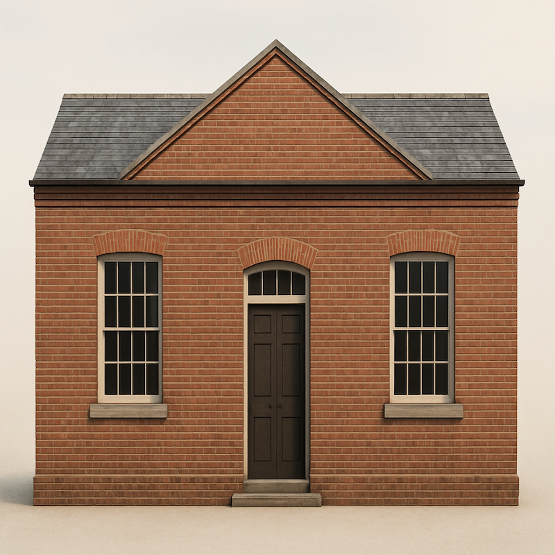

### Floorplan Prompt

An orthographic architectural floor plan drawn at 1:100 scale of a late 18th-century Georgian Sunday School building, representing a simple rectangular single-storey hall used for reading and religious instruction. The structure is brick with timber truss roof, loadbearing external walls (450 mm), and minimal internal partitions. The plan shows a single open hall with symmetrically aligned entrance doors and evenly spaced windows on both long elevations. Doors and windows are shown accurately, symmetrically aligned, and evenly spaced. Black linework on light parchment background, true 1:100 scale, no text or labels. --no text, annotations, people, furniture, shadows, 2D perspective.

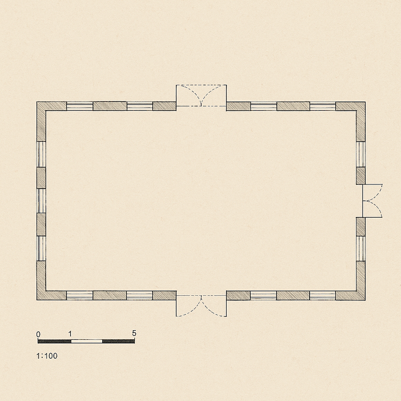

---

## SS-02 — Template v1 Output

### Façade Prompt

A realistic orthographic front elevation corresponding to the early 19th-century neoclassical floor plan of a monumental interdenominational Sunday School. The façade is built in ashlar sandstone with Doric pilasters, a central pediment, and tall sash windows evenly spaced across the elevation. The symmetrical composition conveys civic grandeur and industrial philanthropy. Materials include sandstone masonry, slate roof, and stone detailing. Rendered in daylight, orthographic projection, realistic materials, no people or text, with the complete façade visible within frame.

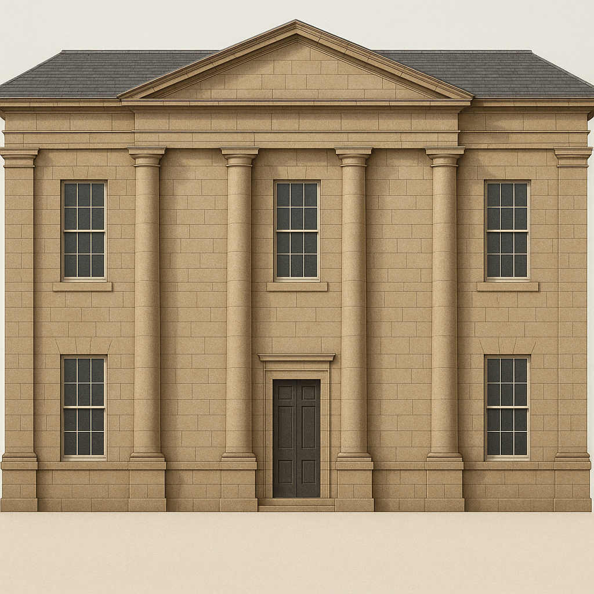

### Floorplan Prompt

An orthographic architectural floor plan drawn at 1:100 scale of an early 19th-century Georgian Sunday School, representing a monumental multi-storey building designed for large-scale instruction. The structure is sandstone masonry with loadbearing external walls (600 mm) and internal column supports defining wide hall spaces. The plan shows a grand central hall flanked by symmetrical classroom bays, with staircases at both ends for upper floors. Doors and windows are shown accurately, symmetrically aligned, and evenly spaced. Black linework on light parchment background, true 1:100 scale, no text or labels. --no text, annotations, people, furniture, shadows, 2D perspective.

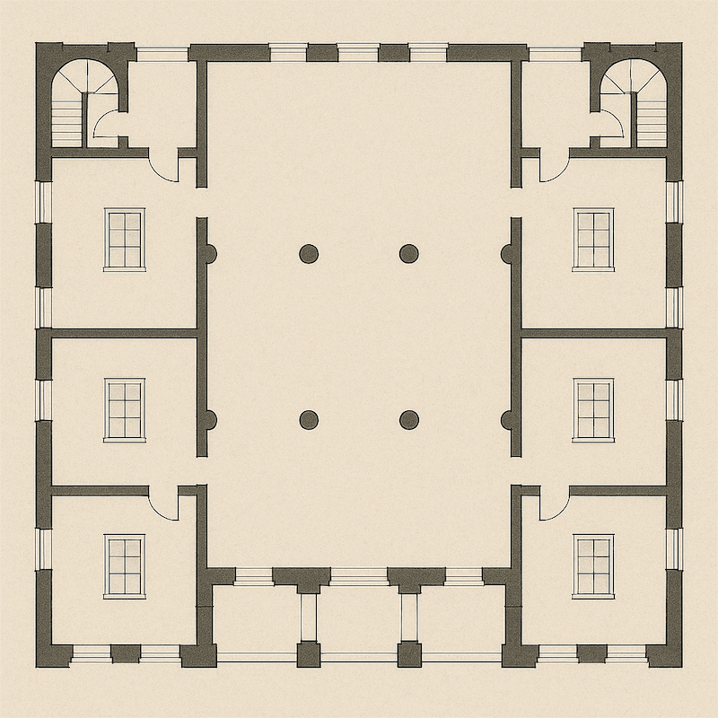

---

## SS-03 — Template v1 Output

### Façade Prompt

A realistic orthographic front elevation corresponding to the Georgian-Regency floor plan of a grand Nonconformist Sunday School. The symmetrical stone façade features a central pediment, pilasters, and arched windows on upper floors. The building expresses civic pride through its balanced classical proportions and restrained ornament. Materials include dressed stone, slate roofing, and detailed window surrounds. Rendered in daylight, orthographic projection, realistic materials, no people or text, full façade visible in frame.

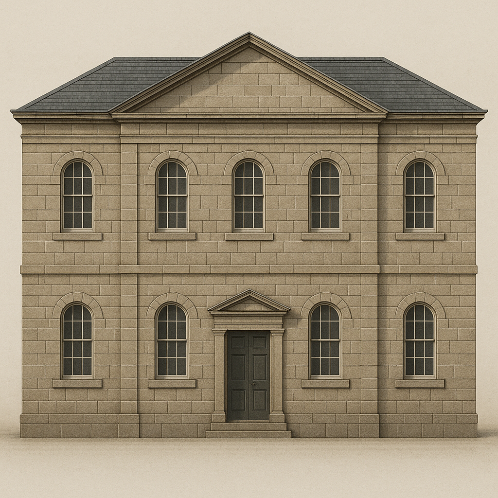

### Floorplan Prompt

An orthographic architectural floor plan drawn at 1:100 scale of an early 19th-century Georgian-Regency Sunday School with a formal rectangular plan. The structure is stone-built with thick loadbearing walls (500 mm) and internal partitions forming classrooms and corridors. The plan shows a central hall flanked by classrooms and staircases at both ends. Doors and windows are accurately aligned and evenly spaced. Black linework on light parchment background, true 1:100 scale, no text or labels. --no text, annotations, people, furniture, shadows, 2D perspective.

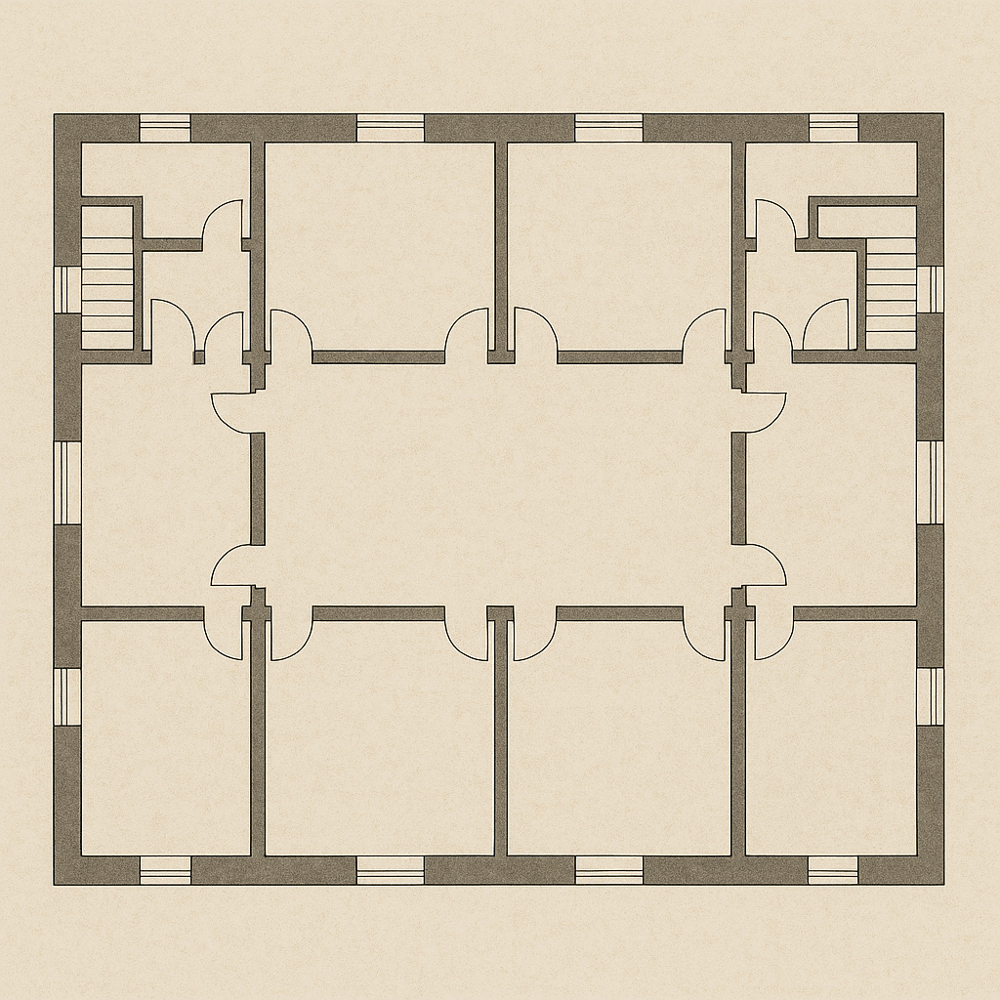

---

## SS-04 — Template v1 Output

### Façade Prompt

A realistic orthographic front elevation corresponding to the Neo-Greek floor plan of an early 19th-century Sunday School. The symmetrical sandstone façade features pilasters, pedimented windows, and a simple entablature. The building conveys classical rationality typical of Presbyterian architecture. Materials include smooth sandstone masonry and slate roofing. Rendered in daylight, orthographic projection, realistic materials, no people or text, full façade visible.

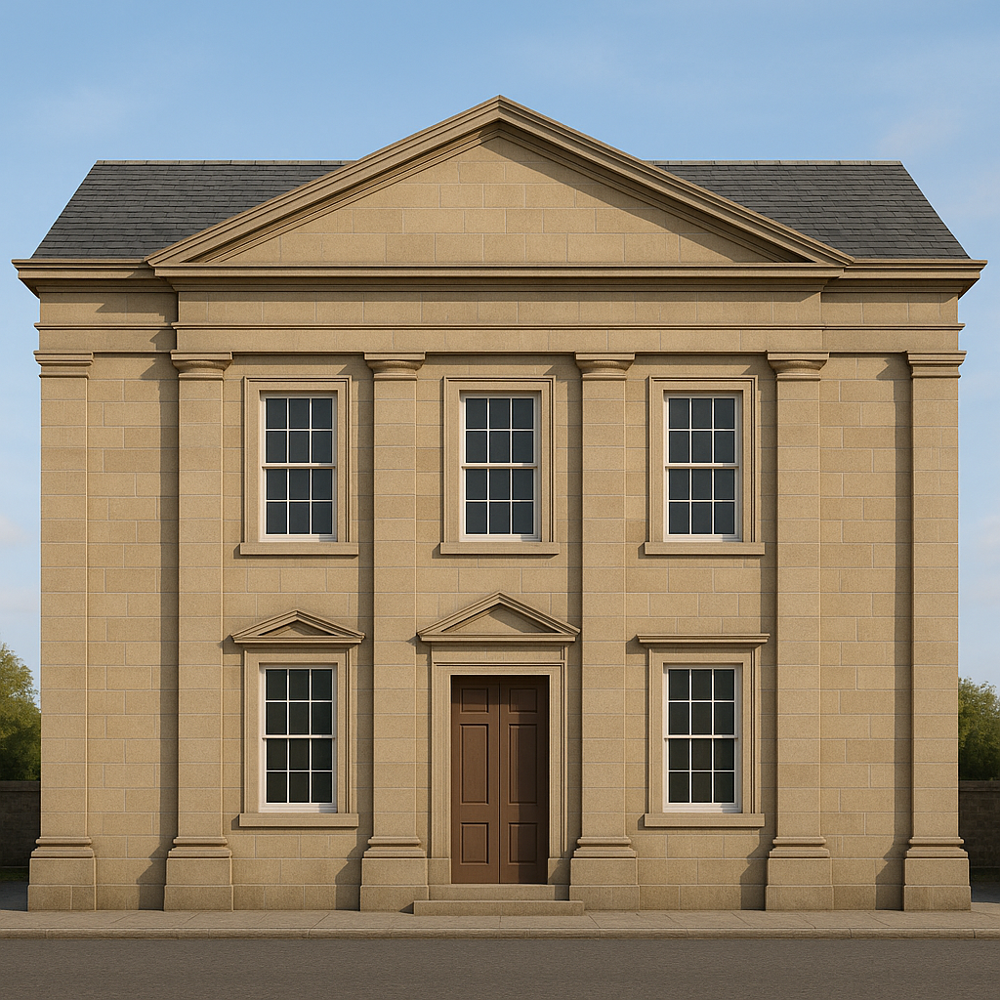

### Floorplan Prompt

An orthographic architectural floor plan drawn at 1:100 scale of an early 19th-century Neo-Greek Presbyterian Sunday School. The structure is stone with thick loadbearing external walls and symmetrical classroom arrangement. The plan shows a central corridor with classrooms on either side and staircases at both ends. Doors and windows are accurately aligned and evenly spaced. Black linework on light parchment background, true 1:100 scale, no text or labels. --no text, annotations, people, furniture, shadows, 2D perspective.

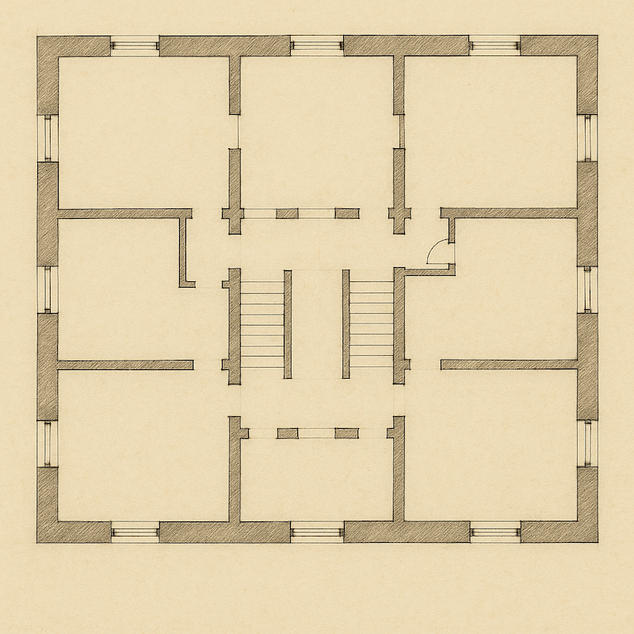

---

## SS-05 — Template v1 Output

### Façade Prompt

A realistic orthographic front elevation corresponding to the late Georgian floor plan of a Wesleyan Sunday School. The façade is built in coursed stone with Georgian symmetry and evenly spaced sash windows. The design is modest and utilitarian, reflecting early urban Methodist architecture. Materials include light grey stone with simple moulded lintels and a slate roof. Rendered in daylight, orthographic projection, realistic materials, no people or text, full façade in frame.

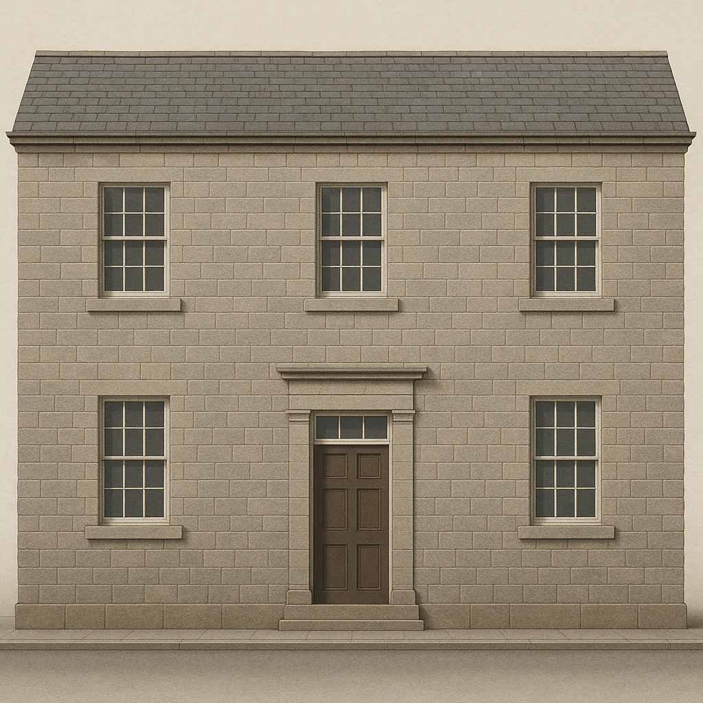

### Floorplan Prompt

An orthographic architectural floor plan drawn at 1:100 scale of a late Georgian urban Methodist Sunday School. The structure is coursed stone with loadbearing walls and regular window spacing. The plan shows a rectangular hall with side classrooms and staircases providing vertical access. Doors and windows are shown accurately, symmetrically aligned, and evenly spaced. Black linework on light parchment background, 1:100 scale, no text or labels. --no text, annotations, people, furniture, shadows, 2D perspective.

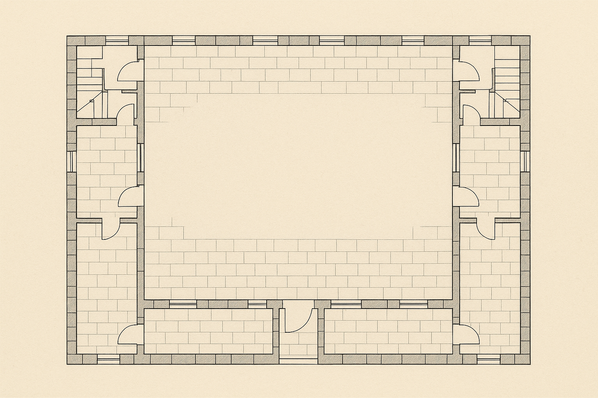

---

## SS-06 — Template v1 Output

### Façade Prompt

A realistic orthographic front elevation corresponding to the early Victorian Gothic floor plan of a Baptist Sunday School. The façade features pointed lancet windows, a steep pitched roof, and buttressed corners, typical of Gothic Revival design. Materials include coursed stonework and slate roofing with subtle tracery in the windows. The composition is symmetrical with window rhythm matching the plan. Rendered in daylight, orthographic projection, realistic materials, no people or text, full façade visible.

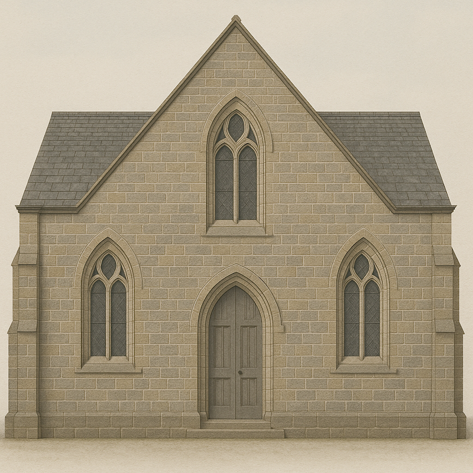

### Floorplan Prompt

An orthographic architectural floor plan drawn at 1:100 scale of an early Victorian Gothic Revival Baptist Sunday School attached to a chapel. The structure is stone with thick external walls and pointed arch doorways. The plan shows an irregular L-shaped arrangement with a central hall connected to the chapel nave and small classrooms adjoining. Doors and windows are symmetrically aligned and accurately placed. Black linework on light parchment background, true 1:100 scale, no text or labels. --no text, annotations, people, furniture, shadows, 2D perspective.

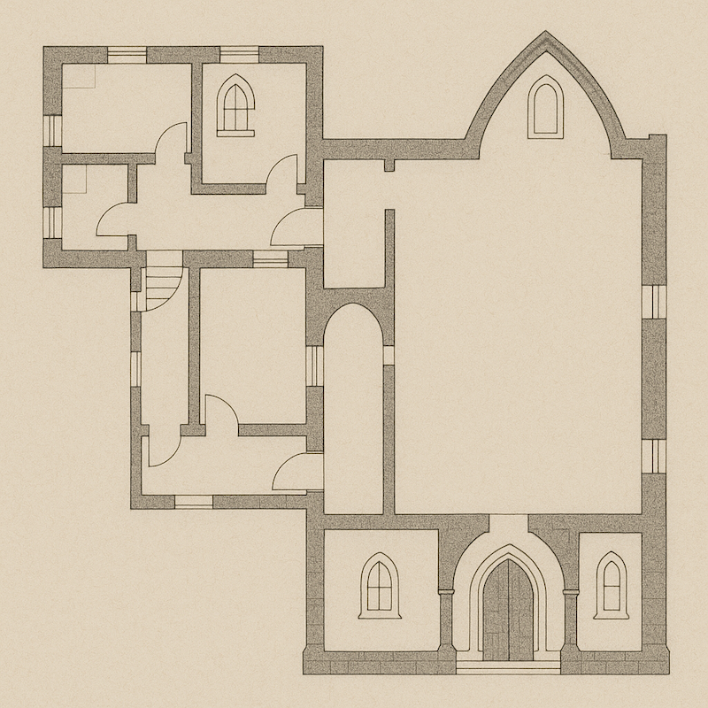

---

## SS-07 — Template v1 Output

### Façade Prompt

A realistic orthographic front elevation corresponding to the mid-Victorian floor plan of a Unitarian Sunday School. The façade is classical with simplified detailing, featuring tall rectangular windows and a pedimented entrance. The building expresses rational moral design through proportion and restraint. Materials include ashlar stone with slate roof. Rendered in daylight, orthographic projection, realistic materials, no people or text, full façade visible.

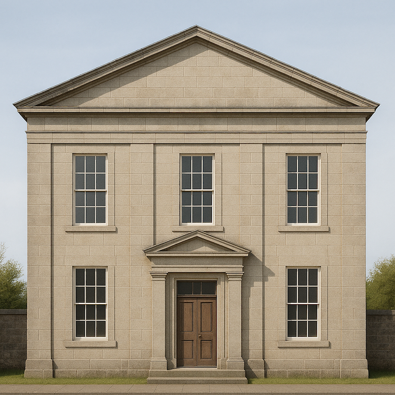

### Floorplan Prompt

An orthographic architectural floor plan drawn at 1:100 scale of a mid-Victorian Unitarian Sunday School. The structure is stone-built with loadbearing walls and internal partitions forming classrooms and stair bays. The plan shows a rectangular main hall flanked by smaller teaching rooms with symmetrical corridor access. Doors and windows are accurately spaced and symmetrically arranged. Black linework on light parchment background, true 1:100 scale, no text or labels. --no text, annotations, people, furniture, shadows, 2D perspective.

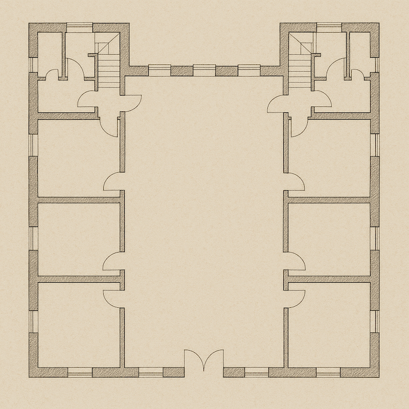

---

## SS-08 — Template v1 Output

### Façade Prompt

A realistic orthographic front elevation corresponding to the mid-late Victorian Gothic floor plan of a Congregational Sunday School. The façade is vernacular Gothic Revival with pointed windows, sandstone masonry, and modest ornament. The symmetrical composition reflects Nonconformist modesty and regional adaptation. Materials include sandstone with slate roof and stone tracery. Rendered in daylight, orthographic projection, realistic materials, no people or text, full façade visible.

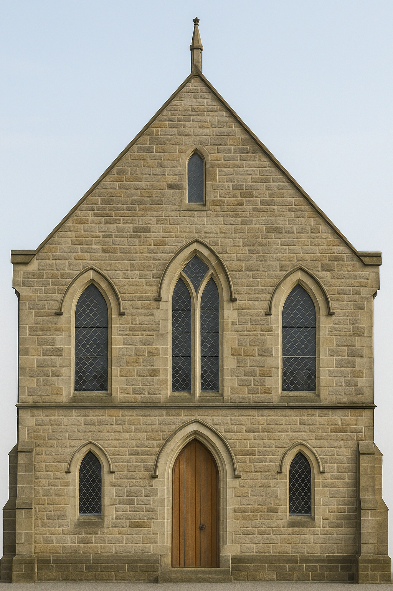

### Floorplan Prompt

An orthographic architectural floor plan drawn at 1:100 scale of a mid-late Victorian Gothic Revival Congregational Sunday School. The structure is sandstone masonry with thick loadbearing walls and internal partitions dividing classrooms and hall. The plan shows a central hall with smaller rooms arranged symmetrically on either side. Doors and windows are accurately positioned and evenly spaced. Black linework on light parchment background, true 1:100 scale, no text or labels. --no text, annotations, people, furniture, shadows, 2D perspective.

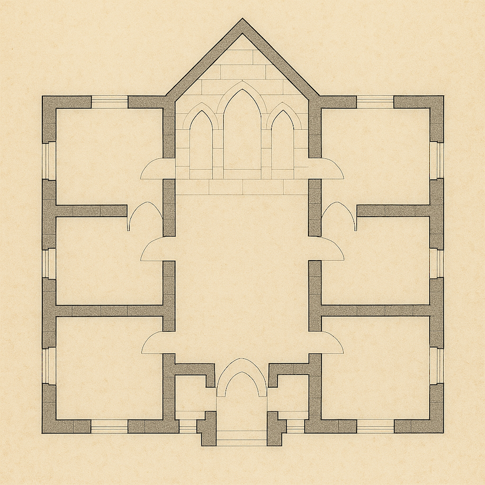

---

## SS-09 — Template v1 Output

### Façade Prompt

A realistic orthographic front elevation corresponding to the late Victorian Italianate floor plan of the Saltaire Sunday School. The façade is monumental with giant round-arched windows, pilasters, and a richly moulded cornice. The symmetrical composition expresses civic grandeur typical of model village philanthropy. Materials include fine ashlar sandstone, stone dressings, and slate roofing. Rendered in daylight, orthographic projection, realistic materials, no people or text, full façade shown edge to edge.

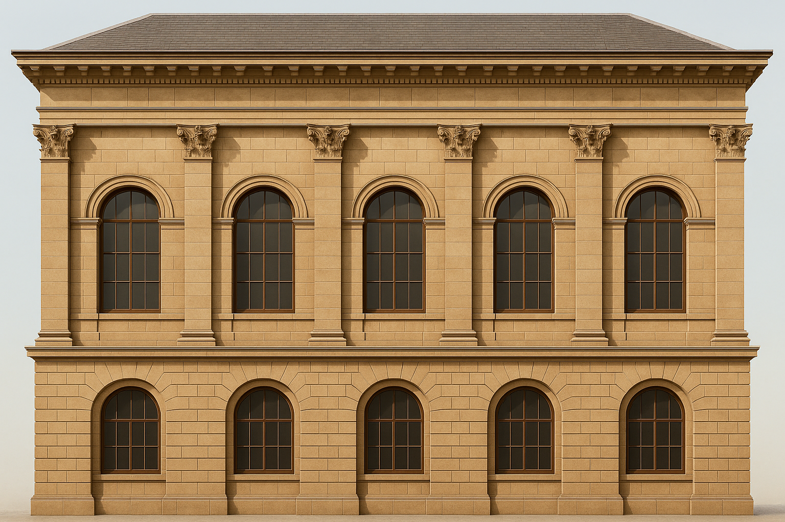

### Floorplan Prompt

An orthographic architectural floor plan drawn at 1:100 scale of a late Victorian Italianate Sunday School within the Saltaire model village. The structure is ashlar stone with thick external walls (600 mm) and symmetrical classroom arrangement around a central corridor. The plan shows a large central stairwell, evenly spaced classrooms, and axial circulation reflecting industrial order. Doors and windows are accurately shown, symmetrically aligned, and evenly spaced. Black linework on light parchment background, true 1:100 scale, no text or labels. --no text, annotations, people, furniture, shadows, 2D perspective.

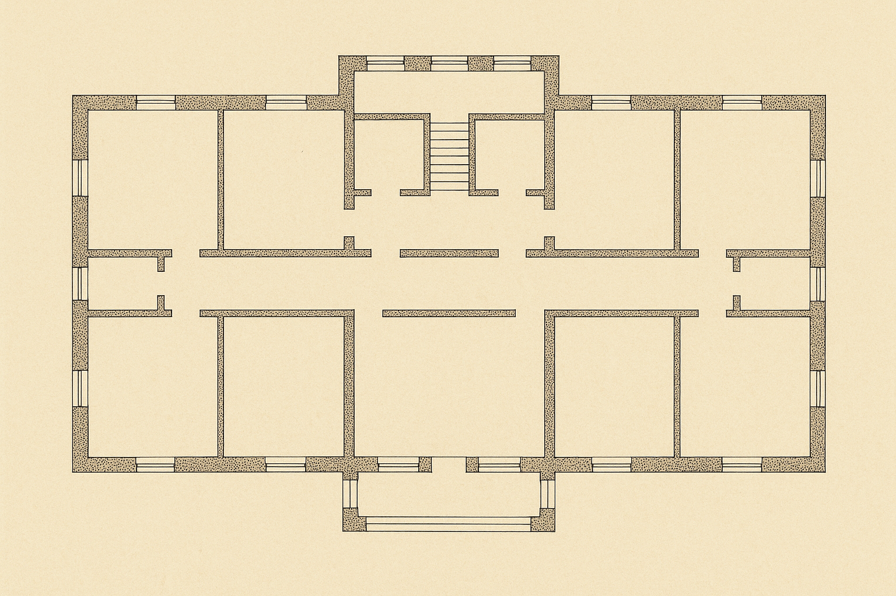

