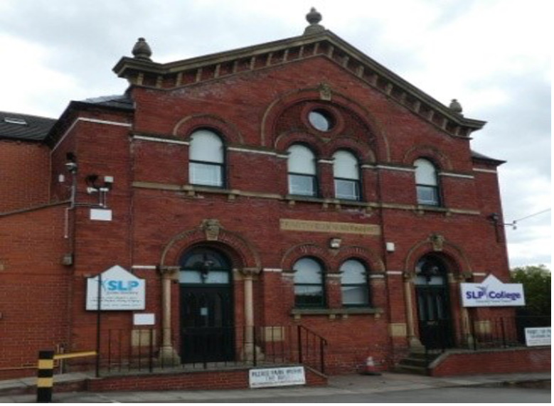
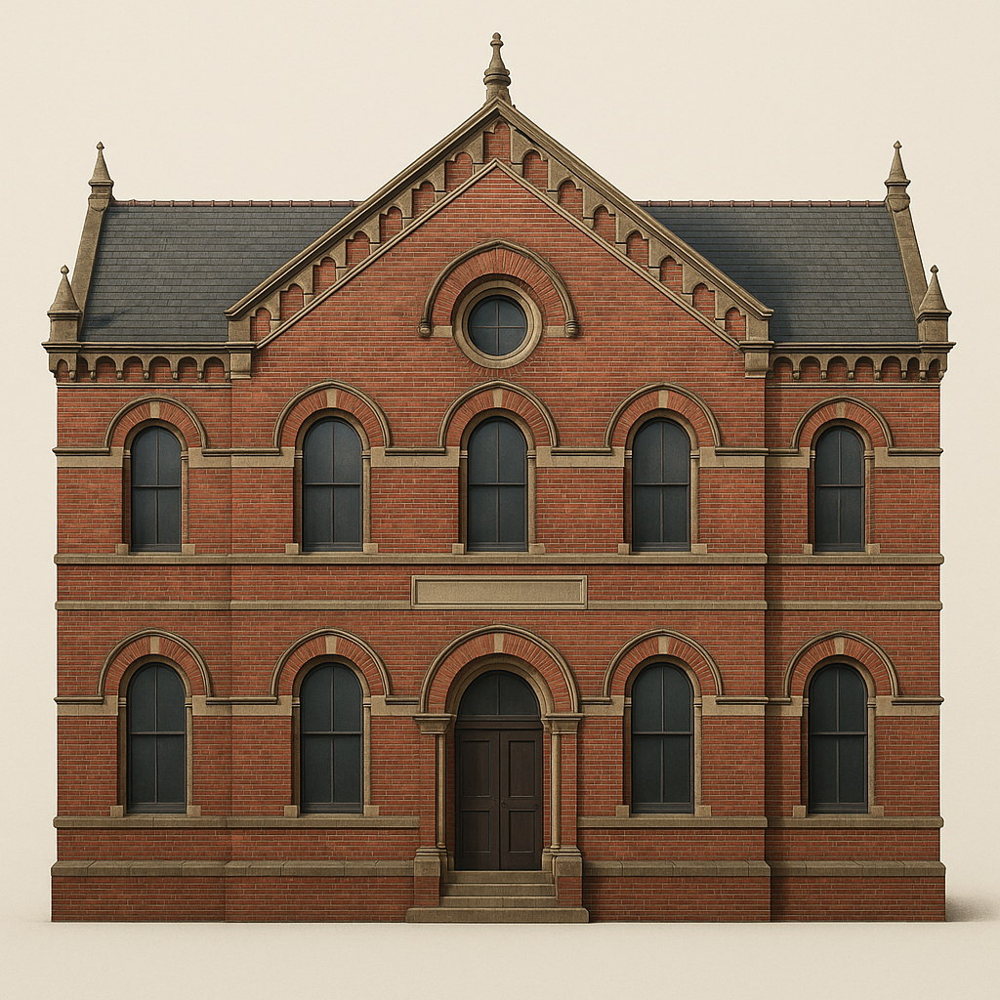
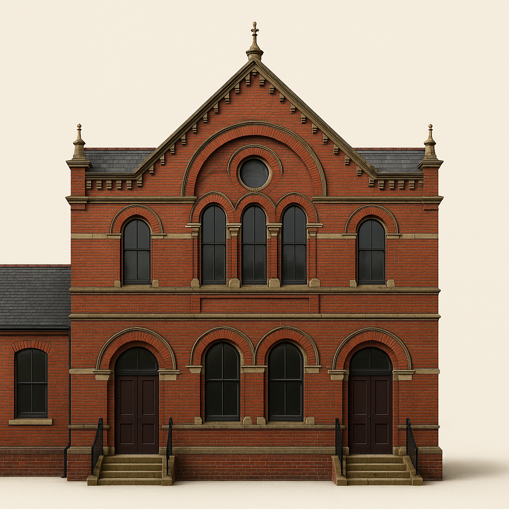
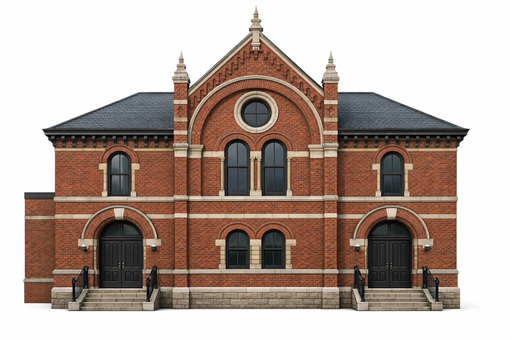

# MH-02 — Reverse Prompt → Template v4 Regeneration Refinement Case (Brunswick — SS-05)

This case documents a Phase 3 refinement loop using the Brunswick Methodist Sunday School historical reference image (SS-05).

The reference image was reverse-prompted into the Template v4 façade format.  
The filled template prompt was then iteratively refined to test and improve architectural coherence against the reference Sunday School image.

Template version used:
- Façade template: ../templates/template_v4_exterior.md

---

## 1) Historical Reference Image (Ground Truth — SS-05)

Brunswick Methodist Sunday School  
Period: 1825  
Location: Manchester  

Reference image from the historical dataset (SS-05).

Source:  
Recorded in `docs/04_historical_reference_images.md`  
(SS-05 — Brunswick Methodist Sunday School)

---

## 2) Filled Template Prompt — Iteration 0 (Baseline / Under-Specified)

A highly detailed photorealistic architectural elevation rendering showing the front elevation of a late-19th-century institutional building (Victorian civic / educational building) designed in the Victorian Gothic Revival style. The image shows the building alone against a neutral, context-free background so that the focus is entirely on the architecture.

The building has a strongly symmetrical façade with a central projecting bay and is depicted with full accuracy to its real proportions, materials, and form.

Visible architectural details include:  
• roof form: steeply pitched gabled roof with slate covering, a dominant central gable, decorative stone coping, small ornamental finials at gable peaks, and modest ridge detailing; no chimneys visible on the primary façade  
• wall materials: deep red brick masonry laid in regular courses, contrasted with pale stone dressings and lintels, stone string courses dividing storeys, and stone detailing around openings  
• windows: vertically aligned arched windows arranged symmetrically across the façade; ground-floor windows are tall with rounded arches and stone voussoirs; upper-floor windows are smaller but similarly arched; a prominent circular oculus window is set within the central gable  
• doors: central arched entrance door set within a stone surround, featuring a rounded arch head and dark timber double doors  
• ornamentation: stone string courses, arched stone hood moulds, decorative brickwork around arches  
• façade rhythm: five-bay symmetrical composition with a dominant central bay  
• distinctive features: central gabled projection with circular oculus window  

Render all materials (brick, stone, slate, timber, metal) with accurate texture and detail.  
Negative instructions: exclude all surrounding context and exclude any invented or modern elements.

---

## 3) Filled Template Prompt — Iteration 1 (Quantified Openings)

A highly detailed photorealistic architectural elevation rendering showing the front elevation of a late-19th-century institutional building designed in the Victorian Gothic Revival / Victorian Romanesque-influenced brick civic style. The image shows the building alone against a neutral, context-free background so that the focus is entirely on the architecture.

The building has a mostly symmetrical two-storey façade with a dominant central gabled composition, and is depicted with full accuracy to its real proportions, materials, and form. A lower, plainer brick side wing is attached on the far left, set slightly back from the main façade.

Visible architectural details include:  
• roof form: broad front-facing gable with steep pitch; dark slate roof; deep bracketed eaves; finials at gable corners and apex  
• wall materials: dark red brick with pale stone banding and trim; brick arches over openings; raised plinth  
• windows:  
– upper floor: four tall arched windows arranged 1–2–1  
– ground floor (centre): two smaller arched windows arranged as a pair  
– gable: one circular oculus window above the paired upper windows  
• doors: two arched entrance doors, one left and one right, each with dark timber double doors  
• ornamentation: concentric brick arches framing the central gable; stone string courses  
• façade rhythm: three-part composition (left bay, central gabled bay, right bay)  
• distinctive features: dominant central gable with oculus; paired central windows; two arched entrances  

Render all materials (brick, stone, slate, timber, metal) with accurate texture and detail.  
Negative instructions: exclude all surrounding context and exclude any invented or modern elements.

---

## 4) Filled Template Prompt — Iteration 2 (Structurally Locked)

A highly detailed photorealistic architectural elevation rendering showing the front elevation of a late-19th-century institutional building designed in the Victorian Gothic Revival / Victorian Romanesque-influenced brick civic style. The image shows the building alone against a neutral, context-free background so that the focus is entirely on the architecture.

The building has a mostly symmetrical two-storey façade with a dominant central gabled composition, and is depicted with full accuracy to its real proportions, materials, and form. A lower, plainer brick side wing is attached on the far left, set slightly back from the main façade.

Visible architectural details include:  
• roof form: steep front-facing gable with slate roof; deep bracketed eaves; finials at gable corners and apex  
• wall materials: dark red brick with pale stone banding; brick arches; raised plinth  
• windows (exact arrangement):  
– upper floor: FOUR arched windows arranged 1–2–1  
– ground floor (centre): TWO smaller arched windows as a paired set  
– gable: ONE circular oculus window centred above the paired upper windows  
The paired upper windows must align directly above the paired lower windows.  
• doors: TWO arched entrance doors (left and right), each with dark timber double doors  
• ornamentation: concentric brick arches framing the central gable; stone string courses  
• façade rhythm: left bay, central gabled bay, right bay  
• distinctive features: central gable with oculus; paired windows; two entrances; side wing on far left  

Render all materials (brick, stone, slate, timber, metal) with accurate texture and detail.  
Negative instructions: exclude all surrounding context and exclude any invented or modern elements.  
Specifically exclude any third window beneath the oculus.

---

## 5) Regenerated Outputs

### Iteration 0

### Iteration 1

### Iteration 2

---

