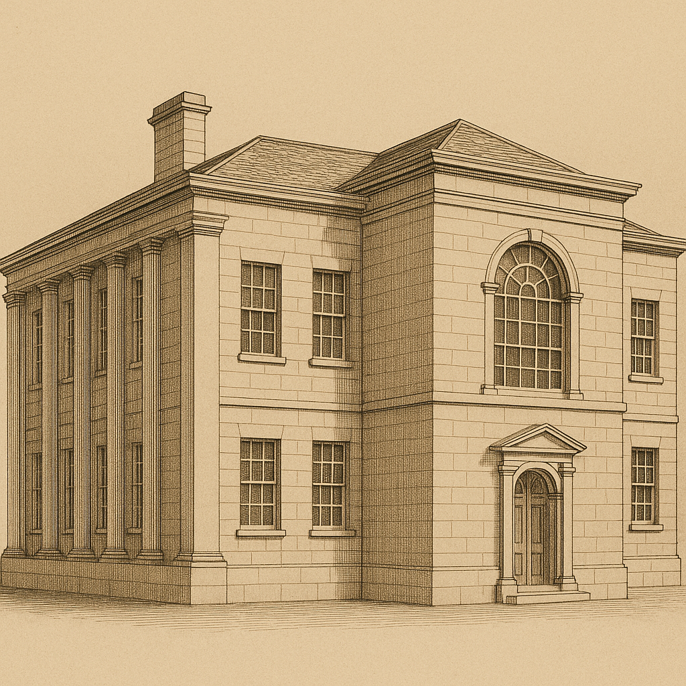

# Template v4 Regeneration Refinement Case (Mill Hill - SS07)

This case documents a Phase 3 refinement loop using the Mill Hill Chapel Sunday School historical reference image (SS-07).

The reference image was reverse-prompted into the Template v4 façade format.  
The filled template prompt was then used to regenerate the building in order to test architectural coherence.

**Template version used:**
- Façade template: `../templates/template_v4_exterior.md`

---

## 1) Historical Reference Image (Ground Truth — SS-07)

Reference image from the historical dataset (SS-07).

---

## 2) Filled Template Prompt – Iteration 1

Reverse prompt output (template-formatted):

A highly detailed sepia architectural engraving / historical ink drawing showing the front-left oblique elevation of a Georgian civic or institutional building designed in the late 18th to early 19th century Neoclassical style. The image shows the building alone against a neutral, context-free background so that the focus is entirely on the architecture.  
The building has a rectangular, two-storey massing with a strong classical symmetry to the main façade and a clearly articulated corner volume, and is depicted with full accuracy to its real proportions, materials, and form.

**Visible architectural details include:**

- **Roof form:**  
  Low-pitched hipped roof with a shallow parapet line, no dormers, a single modest chimney stack visible toward the rear, and a restrained classical cornice beneath the roofline.

- **Wall materials:**  
  Smooth ashlar stone masonry in a light tone, with clean planar walls, subtle quoin-like edge definition at corners, and minimal surface ornamentation.

- **Windows:**  
  Evenly spaced rectangular sash windows arranged in strict vertical and horizontal alignment; multi-pane timber sash windows with small square panes; windows set into plain stone surrounds with flat lintels; a prominent central Venetian (Palladian) window on the front façade at first-floor level, featuring a large semicircular arched central light with radial glazing bars, flanked by narrower rectangular sidelights.

- **Doors:**  
  Two separate entrance doors — one on the front façade and one on the right-hand elevation — each with a simple rectangular timber door set within a shallow projecting porch; porches have plain pedimented gables supported by minimal classical framing; door openings are rectangular with understated surrounds.

- **Ornamentation:**  
  Tall engaged pilasters or shallow classical columns running through both storeys along the left-hand elevation, supporting a continuous entablature; strong horizontal string course separating ground and first floors; restrained classical cornice detailing; no decorative carving beyond classical mouldings.

- **Façade rhythm:**  
  Regular classical bay spacing with evenly distributed window openings; the left elevation shows a rhythmic colonnaded treatment, while the front façade is more planar with a dominant central bay.

- **Distinctive features:**  
  Projecting central bay on the front façade housing the large arched Venetian window; clearly defined corner mass; classical pilaster colonnade along the left side giving a temple-like civic character.

Render all materials (stone masonry, timber window frames, slate roof) with accurate texture and fine engraved linework. The building should appear complete and undistorted, with no perspective exaggeration beyond a restrained architectural elevation view.

**Negative instructions:**  
Exclude all surrounding context (trees, sky, pavement, ground, foliage, shadows, people, cars, signs), and exclude any invented or modern elements not present in the described architecture.

---

## 3) Filled Template Prompt Used for Regeneration

Prompt used to generate the regenerated building:

A highly detailed sepia architectural engraving / historical ink drawing showing the front-left oblique elevation of a Georgian civic or institutional building designed in the late 18th to early 19th century Neoclassical style. The image shows the building alone against a neutral, context-free background so that the focus is entirely on the architecture.  
The building has a rectangular, two-storey massing with a strong classical symmetry to the main façade and a clearly articulated corner volume, and is depicted with full accuracy to its real proportions, materials, and form.

**Visible architectural details include:**

- **Roof form:**  
  Low-pitched hipped roof with a shallow parapet line, no dormers, a single modest chimney stack visible toward the rear, and a restrained classical cornice beneath the roofline.

- **Wall materials:**  
  Smooth ashlar stone masonry in a light tone, with clean planar walls, subtle quoin-like edge definition at corners, and minimal surface ornamentation.

- **Windows:**  
  Evenly spaced rectangular sash windows arranged in strict vertical and horizontal alignment; multi-pane timber sash windows with small square panes; windows set into plain stone surrounds with flat lintels; a prominent central Venetian (Palladian) window on the front façade at first-floor level, featuring a large semicircular arched central light with radial glazing bars, flanked by narrower rectangular sidelights.

- **Doors:**  
  Two separate entrance doors — one on the front façade and one on the right-hand elevation — each with a simple rectangular timber door set within a shallow projecting porch; porches have plain pedimented gables supported by minimal classical framing; door openings are rectangular with understated surrounds.

- **Ornamentation:**  
  Tall engaged pilasters or shallow classical columns running through both storeys along the left-hand elevation, supporting a continuous entablature; strong horizontal string course separating ground and first floors; restrained classical cornice detailing; no decorative carving beyond classical mouldings.

- **Façade rhythm:**  
  Regular classical bay spacing with evenly distributed window openings; the left elevation shows a rhythmic colonnaded treatment, while the front façade is more planar with a dominant central bay.

- **Distinctive features:**  
  Projecting central bay on the front façade housing the large arched Venetian window; clearly defined corner mass; classical pilaster colonnade along the left side giving a temple-like civic character.

Render all materials (stone masonry, timber window frames, slate roof) with accurate texture and fine engraved linework. The building should appear complete and undistorted, with no perspective exaggeration beyond a restrained architectural elevation view.

**Negative instructions:**  
Exclude all surrounding context (trees, sky, pavement, ground, foliage, shadows, people, cars, signs), and exclude any invented or modern elements not present in the described architecture.

---

## 4) Regenerated Output

### Iteration 1

