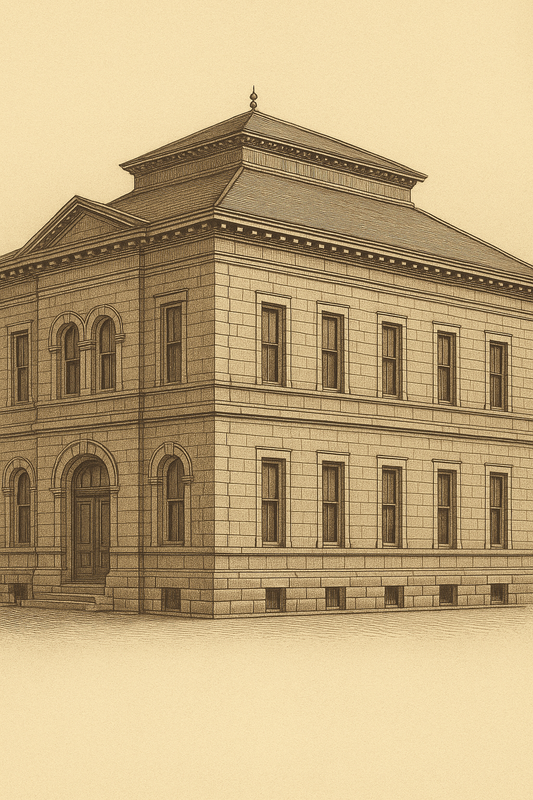
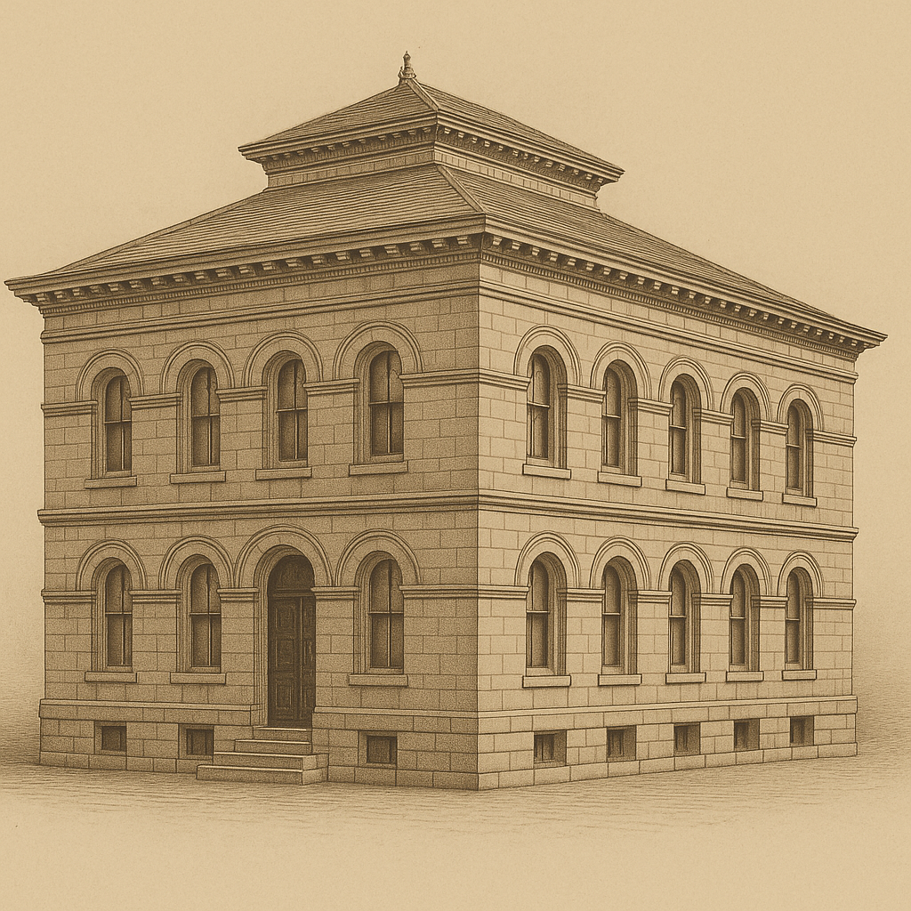
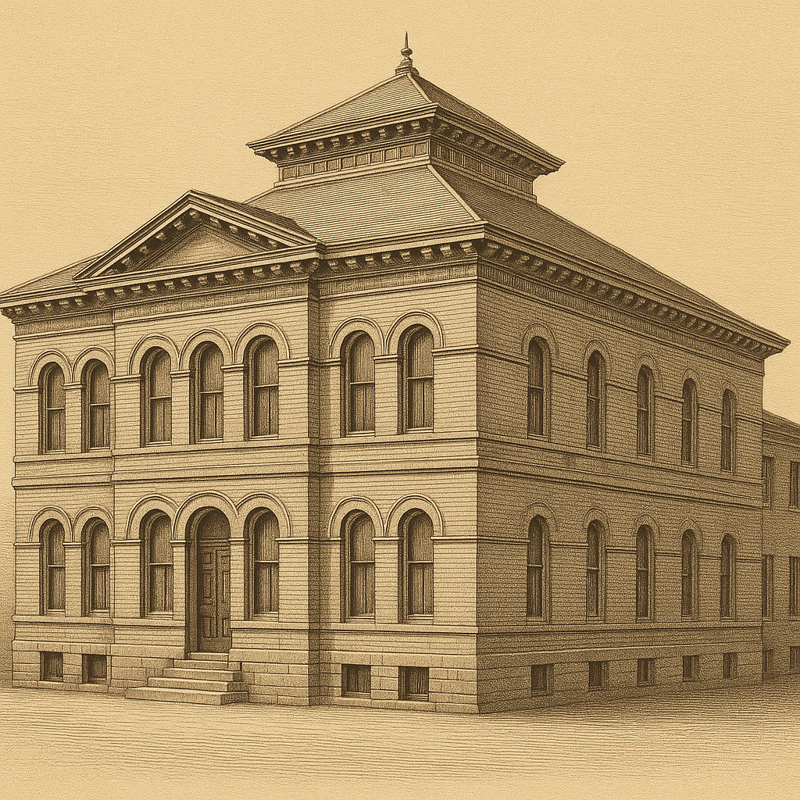
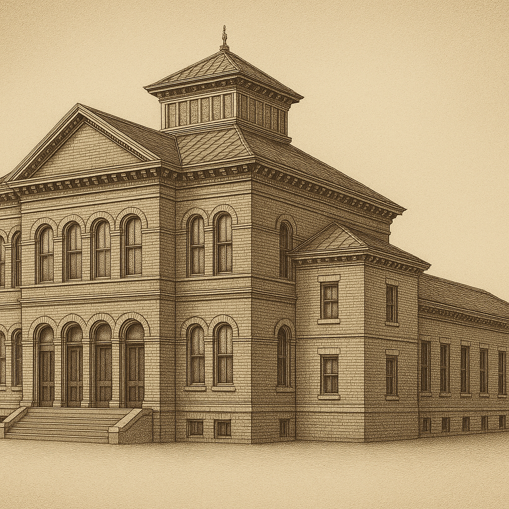
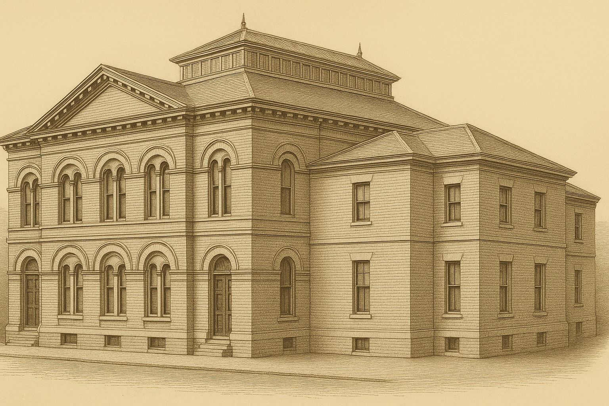

# MH-03 — Reverse Prompt → Template v4 Regeneration Refinement Case (Saltaire — SS-09)

This case documents a Phase 3 refinement loop using the Saltaire Sunday School historical reference image (SS-09).

The reference image was reverse-prompted into the Template v4 façade format.  
The filled template prompt was then iteratively refined to test and improve architectural coherence against the reference Sunday School image.

Template version used:
- Façade template: ../templates/template_v4_exterior.md

---

## 1) Historical Reference Image (Ground Truth — SS-09)

Saltaire Sunday School  
Period: 1868  
Location: Saltaire  

Reference image from the historical dataset (SS-09).

Source:  
Recorded in `docs/04_historical_reference_images.md`  
(SS-09 — Saltaire Sunday School)

---

## 2) Iteration Log (Filled Template Variations)

### Iteration 1 — Initial Filled Prompt (Symmetrical / Neoclassical Revival)

**Filled prompt used:**

A highly detailed sepia engraving showing the three-quarter front-left elevation of a late 19th-century civic/institutional building designed in the Victorian Classical / Neoclassical Revival architectural style. The image shows the building alone against a neutral, context-free background so that the focus is entirely on the architecture. The building has a rectangular, symmetrical massing with a strong horizontal emphasis, expressed through evenly spaced bays and continuous string courses, and is depicted with full accuracy to its real proportions, materials, and form. Visible architectural details include: • roof form: low-pitched hipped roof with a pronounced overhanging cornice, classical dentil detailing beneath the eaves, and a small central roof ridge element; no dormers or chimneys visible • wall materials: smooth ashlar stone masonry in a light grey tone, with clearly defined coursing; rusticated stonework at ground-floor level; prominent stone quoins articulating the building corners • windows: tall round-arched windows at ground floor level with pronounced stone voussoirs and keystones; upper floors feature rectangular sash windows with flat stone lintels and projecting sills; windows arranged in strict vertical alignment across floors, forming a regular bay rhythm • doors: a centrally placed round-arched main entrance door with heavy stone surround, recessed opening, and paneled timber double doors • ornamentation: strong horizontal string courses separating floors; classical cornice with dentils; shallow pilaster-like vertical divisions between window bays; keystone detailing to arched openings • façade rhythm: evenly spaced multi-bay composition across both visible elevations, maintaining strict symmetry and proportional consistency • distinctive features: pronounced classical cornice line, rusticated base level, arched fenestration at ground floor contrasting with rectangular upper windows, corner emphasis through stone quoins Render all materials (stone masonry and carved stone detailing) with accurate texture and detail. The building should appear complete and undistorted, with no perspective exaggeration unless intentionally specified. Negative instructions: exclude all surrounding context (trees, sky, pavement, ground, foliage, shadows, people, cars, signs), and exclude any invented or modern elements not present in the described architecture.

**Regenerated output:**

---

### Iteration 2 — Tightened Roof + Two-Storey + Arches Both Levels

**Filled prompt used:**

A highly detailed sepia engraving showing the three-quarter front-left elevation of a late 19th-century civic/institutional building designed in the Victorian Classical / Italianate Neoclassical Revival architectural style. The image shows the building alone against a neutral, context-free background so that the focus is entirely on the architecture.
The building has a rectangular, two-storey symmetrical massing with a pronounced horizontal emphasis, clearly divided by string courses, and is depicted with full accuracy to its real proportions, materials, and form.

Visible architectural details include:
• roof form: complex low-pitched hipped roof system with multiple stepped roof tiers; a dominant central raised roof block with shallow pitch; wide projecting eaves with strong classical cornices; continuous dentil detailing beneath all eaves; small finial-like ridge elements at roof peaks; no chimneys or dormers
• wall materials: light-toned brick or ashlar masonry with smooth, uniform coursing; subtle rustication at ground floor level; clean corner returns without projections; minimal color variation consistent with late 19th-century civic construction
• windows:
– ground floor: tall, evenly spaced round-arched windows, arranged in paired vertical rhythm; pronounced stone voussoirs and keystones; recessed openings; identical arch height across the façade
– upper floor: round-arched windows mirroring the ground floor alignment, maintaining exact vertical correspondence; slimmer arch proportions; consistent sill and arch heights across all bays
– windows are strictly aligned vertically and horizontally, forming a disciplined classical grid
• doors: a single centrally positioned round-arched main entrance on the front façade; deep recessed arch with heavy masonry surround; tall paneled timber double doors; entrance arch larger and more prominent than window arches
• ornamentation: continuous horizontal string courses separating storeys; strong classical cornice with dentils; shallow pilaster-like wall articulation implied through window spacing rather than applied columns; restrained keystone detailing; no excessive carving
• façade rhythm: strict multi-bay composition across both visible elevations; equal bay widths; consistent spacing between all openings; symmetry reinforced through repetition of arched fenestration
• distinctive features: unified arched window language across both storeys; prominent stepped roof massing rising toward the center; absence of porticos, balconies, or projecting wings; corner expressed purely through masonry return and roof continuity

Render all materials (brick or stone masonry, carved stone detailing, timber doors, slate or metal roofing) with accurate texture and period-authentic engraving linework. The building should appear complete and undistorted, with no perspective exaggeration unless intentionally specified.
Negative instructions: exclude all surrounding context (trees, sky, pavement, ground, foliage, shadows, people, cars, signs), and exclude any invented, modern, or simplified elements not present in the described architecture.

**Regenerated output:**

---

### Iteration 3 — Corner Condition + Explicit Counts (1 Door Assumption)

**Filled prompt used:**

A highly detailed sepia engraving showing the three-quarter front-left elevation of a late 19th-century civic/institutional building designed in the Victorian Classical / Italianate Neoclassical Revival architectural style. The image shows the building alone against a neutral, context-free background so that the focus is entirely on the architecture.

The building has a rectangular two-storey massing with a disciplined classical hierarchy, not a cubic block, and is depicted with full accuracy to its real proportions, materials, and form. The building occupies a corner condition, with a principal front façade and a longer side elevation, both fully visible.

Visible architectural details include:

• roof form:
A tiered pavilion-style hipped roof composed of multiple stepped horizontal roof planes; a raised central roof tier sits above the main roof volume; all roof edges terminate in deep overhanging classical cornices with continuous dentil detailing; subtle ridge finials mark roof peaks; no chimneys, dormers, or skylights

• wall materials:
Light-toned brick masonry laid in uniform horizontal courses; smooth wall finish; subtle rusticated brickwork at ground floor level; brick corner returns without quoins; consistent late-19th-century civic construction texture

• windows:
– front façade, ground floor:
 • exactly five arched openings
 • a single round-arched main entrance positioned slightly left of center
 • two paired round-arched windows to the left of the entrance
 • two paired round-arched windows to the right of the entrance

– front façade, upper floor:
 • exactly six round-arched windows
 • arranged as three evenly spaced paired arches
 • arches directly aligned above the ground-floor openings

– side elevation, both floors:
 • a longer rhythmic sequence of tall rectangular sash windows
 • windows evenly spaced in a linear grid
 • no arched windows on the side elevation

All window openings are vertically aligned floor-to-floor with consistent sill and head heights.

• doors:
A single tall round-arched timber entrance door, recessed within a heavy masonry surround; vertically paneled timber double doors; entrance arch taller and wider than window arches

• ornamentation:
Strong horizontal brick string courses separating storeys; pronounced classical cornice beneath the roofline; restrained keystone detailing to arched openings; no columns, porticos, balconies, or applied decoration

• façade rhythm:
The front façade expresses a paired-arch rhythm, while the side elevation expresses a repetitive rectangular sash rhythm, clearly differentiating primary and secondary elevations

• distinctive features:
Corner-sited institutional building; offset entrance; paired arched fenestration on principal façade only; tiered pavilion roof massing; absence of any projecting wings or modern alterations

Render all materials (brick masonry, carved brick detailing, timber doors, slate or metal roofing) with accurate texture and period-authentic engraving linework. The building should appear complete, proportionally exact, and undistorted, with no perspective exaggeration.

Negative instructions: exclude all surrounding context (trees, sky, pavement, ground, foliage, shadows, people, cars, signs), and exclude any invented, modern, or simplified elements not present in the described architecture.

**Regenerated output:**

---

### Iteration 4 — Stepped Massing + Two Doors (Pediment + Pavilion + Long Wing)

**Filled prompt used:**

A highly detailed sepia engraving showing the three-quarter front-left elevation of a late 19th-century civic/institutional building designed in the Victorian Classical / Italianate Neoclassical Revival architectural style. The image shows the building alone against a neutral, context-free background so that the focus is entirely on the architecture.
The building has a stepped, multi-volume massing (a taller principal front block plus a projecting right-front pavilion plus a longer rear/right wing), and is depicted with full accuracy to its real proportions, materials, and form.

Visible architectural details include:
• roof form: a complex tiered hipped roof composition: the main front block has a low-pitched hipped roof surmounted by a raised central clerestory/monitor roof tier (standing-seam metal look) with small finials; deep overhanging eaves with dentil cornice; the right-front projecting pavilion has its own lower hipped roof that intersects the main roof; the longer rear/right wing continues under a lower hipped roof plane; no chimneys or dormers
• wall materials: light-toned brick masonry in uniform courses; smooth planar walls; subtle horizontal banding/string courses; minimal surface ornament beyond cornices and bands; clean corner returns
• windows:
– front façade, upper floor (principal block): a row of round-arched paired windows (paired arches with a thin mullion between each pair), evenly spaced beneath the cornice, plus a single round-arched window near the right edge of the front block close to the corner transition
– front façade, ground floor (principal block): round-arched paired windows matching the upper rhythm, plus two separate round-arched door openings (see “doors”); all arches have pronounced voussoirs/arched brick heads and clear recessed reveals
– right-front projecting pavilion: rectangular sash windows (one on the front face and one on the side face visible), aligned floor-to-floor with flat heads and simple sills
– long right/rear wing (side elevation): a repetitive grid of tall, narrow rectangular sash windows on both floors, evenly spaced in a strict rhythm; no round arches on this long wing
• doors: two distinct entrance doors on the principal front block, both set in round-arched openings with deep recessed reveals:
– Door 1: positioned toward the far left of the front façade (near the left edge), tall paneled timber door
– Door 2: positioned closer to the center-right of the front façade, tall paneled timber door in a slightly larger round arch; both doors are darker than the masonry and visually prominent
• ornamentation: strong classical cornice with dentils along roof eaves; a large triangular pediment on the left portion of the front block with dentil trim under the pediment eave; continuous horizontal string courses separating storeys; restrained keystone/arch emphasis; no columns, porticos, balconies, or modern signage
• façade rhythm: the principal block uses a paired-arch rhythm (paired round-arched openings), while the projecting pavilion and long wing use rectangular sash rhythms; storey heights remain consistent across volumes
• distinctive features: clearly stepped building layout (principal pedimented block + projecting right-front pavilion + long right/rear wing); two arched entrance doors on the principal front block; raised central monitor/clerestory roof tier; absence of any modern alterations

Render all materials (brick masonry, carved/formed brick arch heads, timber doors, metal or slate roofing) with accurate texture and period-authentic engraving linework. The building should appear complete and undistorted, with no perspective exaggeration unless intentionally specified.
Negative instructions: exclude all surrounding context (trees, sky, pavement, ground, foliage, shadows, people, cars, signs), and exclude any invented or modern elements not present in the described architecture.

**Regenerated output:**

---

### Iteration 5 — “Blueprint-Style” Hard Constraints (Do Not Deviate)

**Filled prompt used:**

A highly detailed sepia engraving showing the three-quarter front-left elevation of a late 19th-century civic/institutional building designed in the Victorian Classical / Italianate Neoclassical Revival architectural style. The image shows the building alone against a neutral, context-free background so that the focus is entirely on the architecture.
The building has a stepped, multi-volume massing (a taller principal front block plus a projecting right-front pavilion plus a longer rear/right wing), and is depicted with full accuracy to its real proportions, materials, and form.

Visible architectural details include:
• roof form: a complex tiered hipped roof composition: the main front block has a low-pitched hipped roof surmounted by a raised central clerestory/monitor roof tier (standing-seam metal look) with small finials; deep overhanging eaves with dentil cornice; the right-front projecting pavilion has its own lower hipped roof that intersects the main roof; the longer rear/right wing continues under a lower hipped roof plane; no chimneys, no dormers, no skylights, no towers
• wall materials: light-toned brick masonry in uniform courses; smooth planar walls; subtle horizontal banding/string courses; minimal surface ornament beyond cornices and bands; clean corner returns
• windows (LOCKED COUNTS + ARRANGEMENT, DO NOT DEVIATE):
– principal front façade, upper floor (taller front block): exactly SIX round-arched windows total, arranged as THREE paired arched-window groups (pair–pair–pair), evenly spaced under the cornice; each pair contains two narrow arched windows separated by a thin mullion; no single arched window on this upper front façade
– principal front façade, ground floor (taller front block): exactly FOUR round-arched windows total, arranged as TWO paired arched-window groups (pair–pair) with the same thin mullion logic; these sit between the two entrance doors; no additional ground-floor arched windows beyond these four
– right-front projecting pavilion: exactly ONE rectangular sash window per floor on the pavilion’s front face (two total), vertically aligned; and exactly ONE rectangular sash window per floor on the pavilion’s side face (two total), vertically aligned; no arched windows on the pavilion
– long rear/right wing (side elevation): exactly EIGHT tall, narrow rectangular sash windows on the upper floor and exactly EIGHT matching rectangular sash windows on the ground floor, evenly spaced and aligned directly above/below each other; no arched windows on the long wing
• doors (LOCKED, ONLY THESE TWO DOORS EXIST): exactly TWO entrance doors on the principal front façade, both in round-arched openings with recessed reveals and dark paneled timber doors:
– Door 1: positioned at the far left end of the front façade (near the left edge), round-arched doorway, dark timber door
– Door 2: positioned to the right of the two paired window groups (closer to center-right of the front façade), round-arched doorway, dark timber door
No third door. No side doors. No extra arched entrances.
• ornamentation: strong classical cornice with dentils along roof eaves; a large triangular pediment on the left portion of the front block with dentil trim under the pediment eave; continuous horizontal string courses separating storeys; restrained arch emphasis; no columns, no porticos, no balconies, no balustrades
• façade rhythm: the principal front block expresses paired-arch groups only (pairs on both floors), interrupted only by the two doors; the pavilion and long wing express a strict rectangular sash rhythm
• distinctive features: clearly stepped building layout (principal pedimented block + projecting right-front pavilion + long right/rear wing); two arched entrance doors on the principal front block; raised central monitor/clerestory roof tier; no modern alterations

Render all materials (brick masonry, formed brick arch heads, timber doors, metal or slate roofing) with accurate texture and period-authentic engraving linework. The building should appear complete and undistorted, with no perspective exaggeration unless intentionally specified.
Negative instructions: exclude all surrounding context (trees, sky, pavement, ground, foliage, shadows, people, cars, signs), and exclude any invented, modern, or simplified elements not present in the described architecture. Also exclude stairs, entry steps, platforms, porches, towers, domes, extra doors, extra arches, and any additional windows beyond the specified counts.

**Regenerated outputs:**

---