# Façade Results – Attribute-Based Evaluation

This document presents façade-level evaluation results for Sunday School buildings generated using the latest template for exterior building images (v4)

Scoring:  
**1 = match, 0 = mismatch, NA = not assessable**

---

## 1780s – Long Millgate Sunday School

**Reference Image:**  
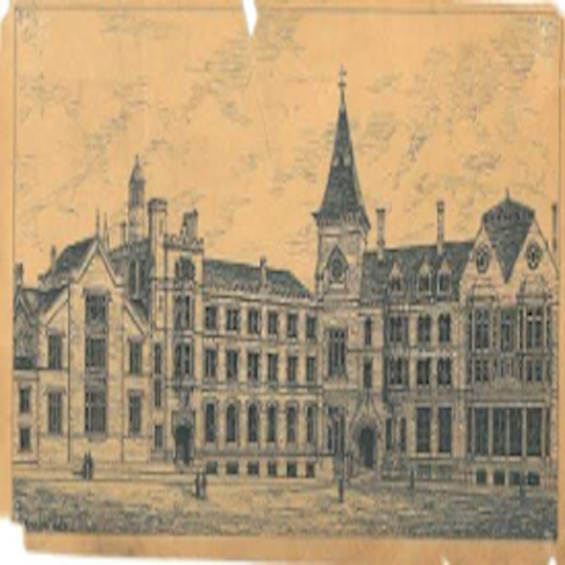

**Generated Output:**  
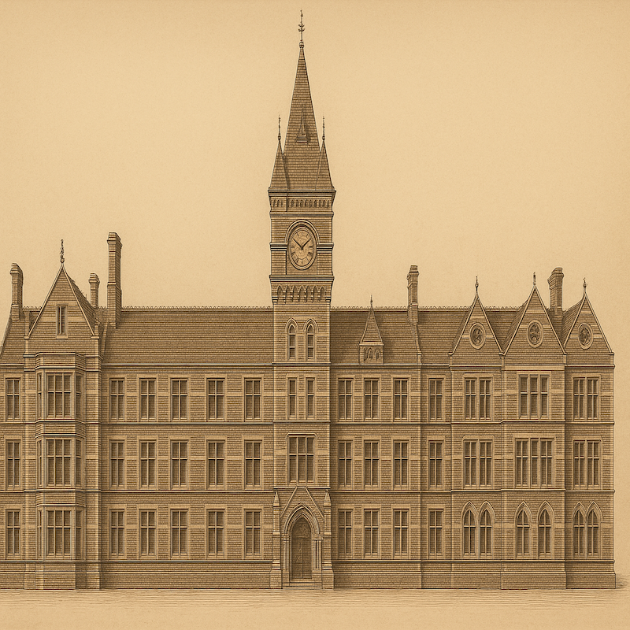

### Door & Window Arrangement
- Entrance doors: **1**  
- Total windows: **NA**  
- Vertical alignment: **0**  
**Subtotal:** 1 / 2

### Historical Period
- Architectural style: **1**  
- Opening forms: **1**  
**Subtotal:** 2 / 2

### Building Composition
- Primary wall material: **1**  
- Secondary materials: **NA**  
**Subtotal:** 1 / 1

### Geometry
- Symmetry: **0**  
- Roof/gable form: **0**  
**Subtotal:** 0 / 2

**Accuracy:**  
```
4 / 7 × 100 = 57.14%
```

---

## 1784–1805 – Stockport Sunday School

**Reference Image:**  
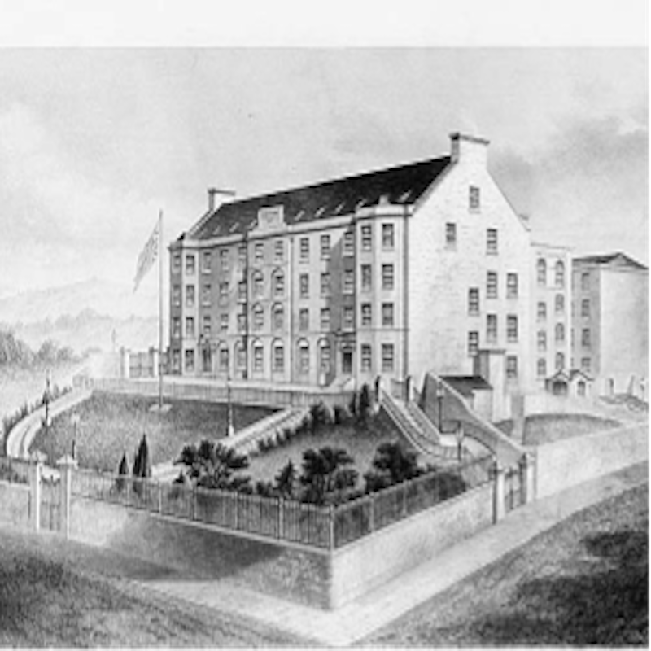

**Generated Output:**  
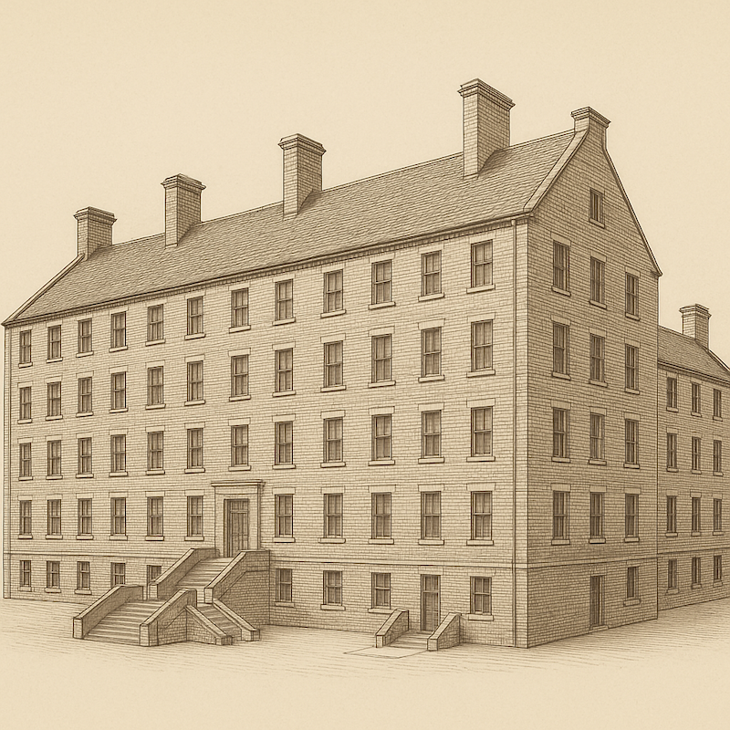

### Door & Window Arrangement
- Entrance doors: **0**  
- Total windows: **0**  
- Vertical alignment: **1**  
**Subtotal:** 1 / 3

### Historical Period
- Architectural style: **1**  
- Opening forms: **1**  
**Subtotal:** 2 / 2

### Building Composition
- Primary wall material: **1**  
- Secondary materials: **0**  
**Subtotal:** 1 / 2

### Geometry
- Symmetry: **1**  
- Roof/gable form: **1**  
**Subtotal:** 2 / 2

**Accuracy:**  
```
6 / 9 × 100 = 66.67%
```

---

## 1809 – Ashton-under-Lyne Sunday School

**Reference Image:**  


**Generated Output:**  
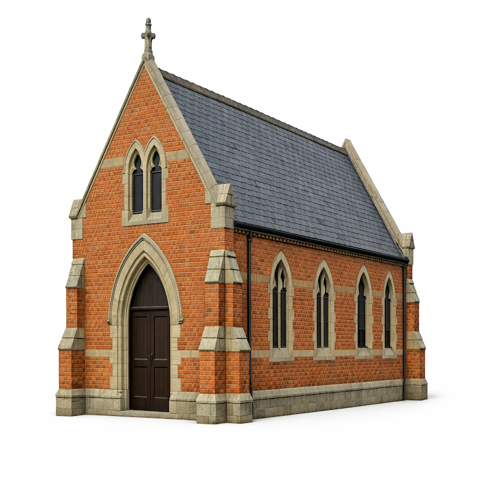

### Door & Window Arrangement
- Entrance doors: **1**  
- Total windows: **0**  
- Vertical alignment: **1**  
**Subtotal:** 2 / 3

### Historical Period
- Architectural style: **1**  
- Opening forms: **1**  
**Subtotal:** 2 / 2

### Building Composition
- Primary wall material: **1**  
- Secondary materials: **0**  
**Subtotal:** 1 / 2

### Geometry
- Symmetry: **0**  
- Roof/gable form: **1**  
**Subtotal:** 1 / 2

**Accuracy:**  
```
6 / 9 × 100 = 66.67%
```

---

## 1820s – Blythewood Sunday School

**Reference Image:**  
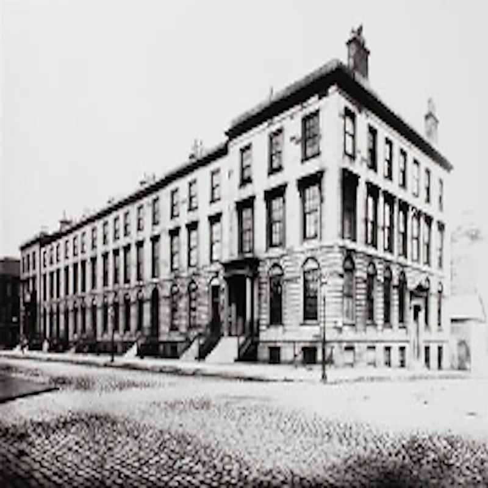

**Generated Output:**  
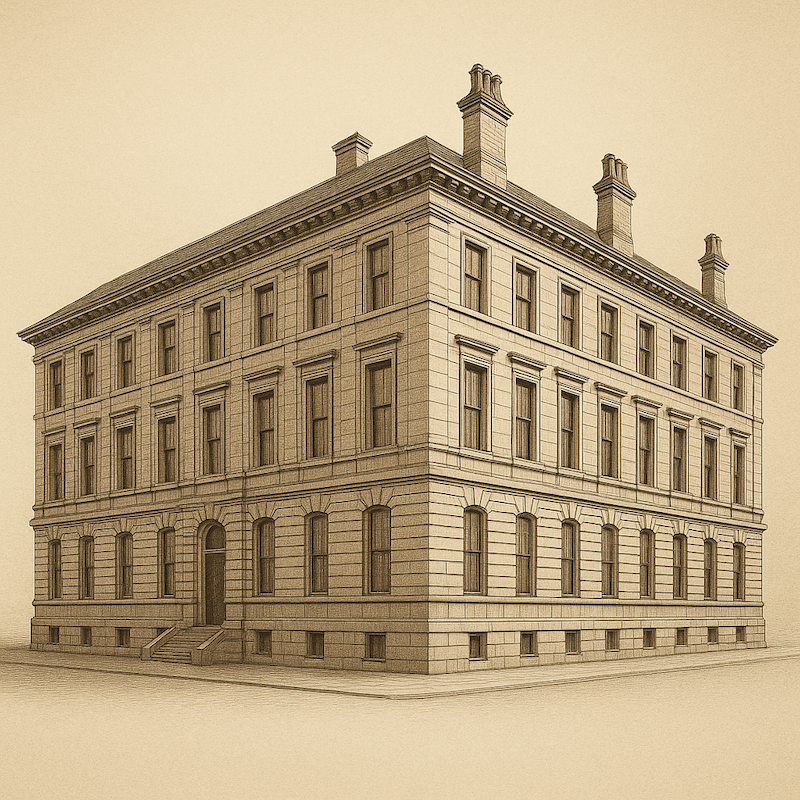

### Door & Window Arrangement
- Entrance doors: **0**  
- Total windows: **0**  
- Vertical alignment: **1**  
**Subtotal:** 1 / 3

### Historical Period
- Architectural style: **1**  
- Opening forms: **1**  
**Subtotal:** 2 / 2

### Building Composition
- Primary wall material: **1**  
- Secondary materials: **0**  
**Subtotal:** 1 / 2

### Geometry
- Symmetry: **0**  
- Roof/gable form: **1**  
**Subtotal:** 1 / 2

**Accuracy:**  
```
5 / 9 × 100 = 55.56%
```

---

## 1825 – Brunswick Methodist Sunday School

**Reference Image:**  


**Generated Output:**  


### Door & Window Arrangement
- Entrance doors: **1**  
- Total windows: **1**  
- Vertical alignment: **1**  
**Subtotal:** 3 / 3

### Historical Period
- Architectural style: **1**  
- Opening forms: **1**  
**Subtotal:** 2 / 2

### Building Composition
- Primary wall material: **1**  
- Secondary materials: **0**  
**Subtotal:** 1 / 2

### Geometry
- Symmetry: **1**  
- Roof/gable form: **1**  
**Subtotal:** 2 / 2

**Accuracy:**  
```
8 / 9 × 100 = 88.89%
```

---

## 1830s–1840s – Hope Chapel Sunday School

**Reference Image:**  
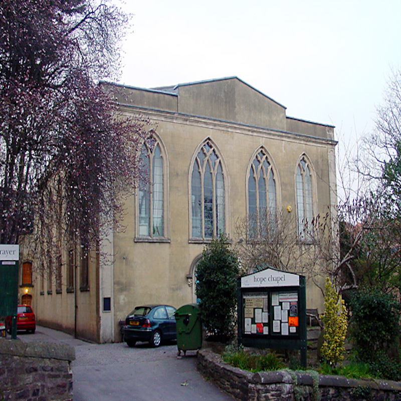

**Generated Output:**  
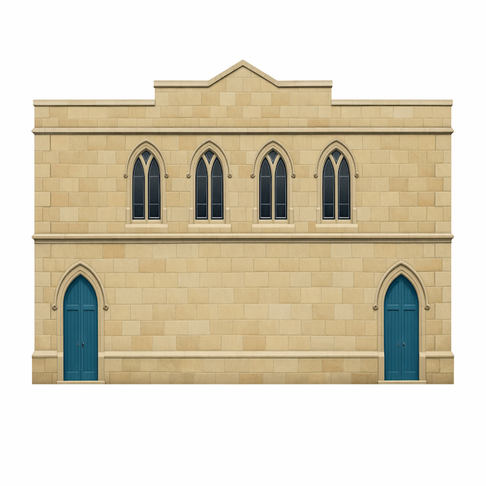

### Door & Window Arrangement
- Entrance doors: **1**  
- Total windows: **1**  
- Vertical alignment: **0**  
**Subtotal:** 2 / 3

### Historical Period
- Architectural style: **1**  
- Opening forms: **1**  
**Subtotal:** 2 / 2

### Building Composition
- Primary wall material: **1**  
- Secondary materials: **0**  
**Subtotal:** 1 / 2

### Geometry
- Symmetry: **1**  
- Roof/gable form: **0**  
**Subtotal:** 1 / 2

**Accuracy:**  
```
6 / 9 × 100 = 66.67%
```

---

## 1850s – Mill Hill Chapel Sunday School

**Reference Image:**  


**Generated Output:**  


### Door & Window Arrangement
- Entrance doors: **0**  
- Total windows: **0**  
- Vertical alignment: **0**  
**Subtotal:** 0 / 3

### Historical Period
- Architectural style: **1**  
- Opening forms: **1**  
**Subtotal:** 2 / 2

### Building Composition
- Primary wall material: **1**  
- Secondary materials: **0**  
**Subtotal:** 1 / 2

### Geometry
- Symmetry: **0**  
- Roof/gable form: **0**  
**Subtotal:** 0 / 2

**Accuracy:**  
```
3 / 9 × 100 = 33.3%
```

---

## 1860s – Ebenezer Congregational Sunday School

**Reference Image:**  


**Generated Output:**  
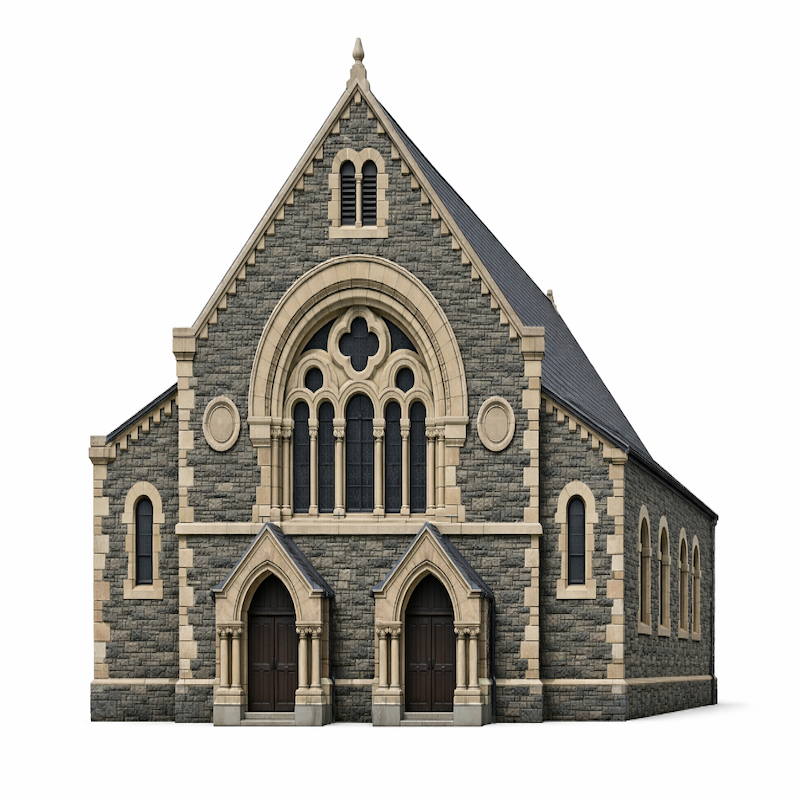

### Door & Window Arrangement
- Entrance doors: **1**  
- Total windows: **0**  
- Vertical alignment: **0**  
**Subtotal:** 1 / 3

### Historical Period
- Architectural style: **1**  
- Opening forms: **1**  
**Subtotal:** 2 / 2

### Building Composition
- Primary wall material: **1**  
- Secondary materials: **0**  
**Subtotal:** 1 / 2

### Geometry
- Symmetry: **1**  
- Roof/gable form: **1**  
**Subtotal:** 2 / 2

**Accuracy:**  
```
6 / 9 × 100 = 66.67%
```

---

## 1868 – Saltaire Sunday School

**Reference Image:**  
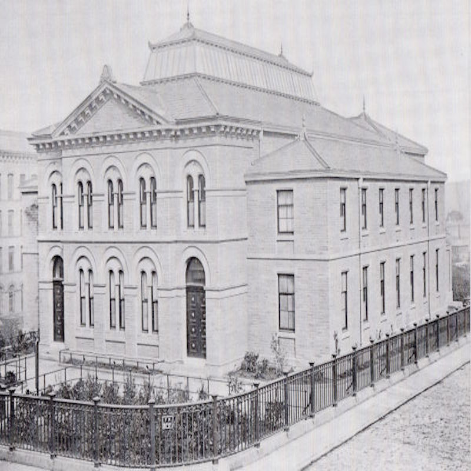

**Generated Output:**  


### Door & Window Arrangement
- Entrance doors: **1**  
- Total windows: **0**  
- Vertical alignment: **1**  
**Subtotal:** 1 / 3

### Historical Period
- Architectural style: **1**  
- Opening forms: **1**  
**Subtotal:** 2 / 2

### Building Composition
- Primary wall material: **1**  
- Secondary materials: **NA**  
**Subtotal:** 1 / 1

### Geometry
- Symmetry: **1**  
- Roof/gable form: **1**  
**Subtotal:** 2 / 2

**Accuracy:**  
```
7 / 8 × 100 = 87.5%
```

---
